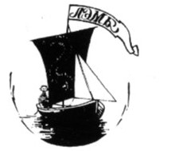

---
output:
  word_document:
    reference_docx: style_for_RMD.docx
bibliography: Fedorova.bib
# csl: "marine-biology.csl"
---

```{r include=FALSE}
library(knitr)

opts_chunk$set(echo = FALSE, warning = FALSE, message = FALSE)
```

```{r packeges}
library(readxl)
library(broom)
library(ggplot2)
library(dplyr)
library(reshape2)
library(gratia)
library(mgcv)
library(cowplot)
library(ggmap)
#citation("ggmap")
```

# Эколого-биологический центр “Крестовский остров”

# Лаборатория Экологии Морского Бентоса

# (гидробиологии)

 

 



 

# К. Федорова

# Характеристика смешанных поселений беломоских мидий на литоральных фукоидах

 

 

# Санкт-Петербург

# 2024

\newpage

###### В данной работе был проанализирован таксономический состав *Mytilus trossulus* и *Mytilus edulis* на фукоидах, мы смотрели на степень прибойности, вид фукоида а так же плотности поселения. Мы выяснили, что оба вида предпочитают жить в затишных местах, на *Ascophyllum nodosum* расхождения ниш не было, однако на *Fucus vesiculosus* прибойность сильно влияет на преобладание того или иного вида. Сами фукоиды влияют лишь опосредованно, и как отдельный фактор не оказывают воздействия на мидий.

# Введение

Понятие «экологическая ниша» было впервые введено американским экологом Джозефом Градинером в начале 20 века [@grinnell1917niche]. В 1917 году он описал нишу как «позицию вида в естественном окружении», подчеркивая взаимосвязь между видом и его средой обитания. В структуре экосистем концепция экологических ниш играет ключевую роль в понимании того, как разные виды сосуществуют и процветают. Позднее появилось более сложное понимание экологической ниши, которое включает не только местообитание, но и роль вида в экосистеме, его отношение к ресурсам и другим видам [@Cary1974]. Важно отметить, что у каждого вида сочетание всех этих факторов уникальное. Разделение ниш разных видов снижает конкуренцию, позволяя нескольким видам сосуществовать в одной и той же области, не оказывая значительного влияния друг на друга.

Вышеизложенное понимание экологической ниши не единственное. Существует и другая концепция, предложенная Г. Э. Хатчинсоном, в которй ниша - это многомерное пространство, в котором каждая ось представляет собой один из факторов, влияющих на жизнь организма [@modelirovanienishi]. Этот подход позволяет учитывать множество экологических условий и ресурсов, необходимых для существования вида. Модель Хатчинсона подразумевает два типа ниш: фундаментальную и реализованную [@Connell1961]. Фундаментальная ниша описывает все возможные условия, в которых организм может существовать, включая все ресурсы и факторы окружающей среды, которые могут поддерживать его жизнь. Реализованная ниша более конкретна и отражает те условия, в которых организм фактически существует в природе, учитывая конкуренцию и другие взаимодействия с окружающей средой [@Connell1961].

Чтобы понять реализованную нишу, обычно строят регрессионные модели, которые описывают связь между присутстивем/отсутствием вида (или его обилием) с некоторыми природными предикторами, в качестве которых выступают абиотические и/или биотические факторы среды [@Elith2009]

Моделирование экологических ниш позволяет выделить ключевые факторы, которые отвечают за распределение сосуществующих видов. Особенно важно это становится если два (или более) вида близки друг к другу и сосуществуют в одном месте. В наиболее острой форме эта проблема проявляется если в анализ попадают криптические виды, т.е. виды, морфологически практически не отличимые, но сохраняющие генетическую изоляцию. Самым известным и хорошо изученным примером такого рода являются мидии комплекса "*Mytilus edulis*" , формирующие смешанные поселения в морях Северной Атлантики и Пацифике [@riginos2005invited; @katolikova2010].

В Белом море обитает два вида этого комплекса - *Mytilus trossulus* и *Mytilus edulis* [@katolikova2010]. Последний считается для Белого моря нативным видом, а *M.trossulus*, полагают, был завезен в акваторию Баренцева и Белого морей на кораблях с побережья Атлантики во время II Мировой Войны [@vainola2011mytilus]. Экспансия *M.trossulus* была отмечена и в других морях европейской Атлантики [@beaumont2008three]. После того, как это обнаружили, теме взаимодействий *M. trossulus* и *M. edulis* друг с другом и со средой их обитания было посвящено много работ [@safonov2014; @ershova2024; @kruglova2017, @beaumont2008three, @katolikova2010, @riginos2005invited]. Однако работ специально направленных на моделирование экологических ниш двух видов пока проведено не было. Самым изученным фактором, регулирующим распределение двух видов, является соленость [@riginos2005invited; @safonov2014; @fokina2013; @fokina2010]. Для Балтики показано, что *M. trossulus* более обильны в опресненных участках внутренней части Балтики, в то время как области с нормальной соленостью занимают преимущественно *M. edulis* [@riginos2005invited]. Помимо солености, видимо, распределение двух видов связано и с прибойностью: *M. trossulus* тяготеют к затишным участкам акваторий (@safonov2014). Третий известный фактор, регулирующий распределение видов, но уже в масштабах единиц метров, связан с характером субстрата. Известно, что доля *M. trossulus* на фукоидах достоверно выше, чем на грунте [@safonov2014; @katolikova2016genetic]. Это всё говорит о том, что два близких вида, заселяя одно местообитание, демонстрируют разделении экологических ниш.

Однако до сих пор остаются невыясненными ряд вопросов. Во-первых, фукоиды, которые выступают в качестве фактора, определяющего сегрегацию двух видов, сами по себе формируют достаточно гетерогенный биотоп - пояс фукоидов. Этот пояс сформирован нескольким видами бурых водорослей *Ascophyllum nodosum*, *Fucus vesiculosus*, *F. distichus*, *F. serratus* [@evseeva2023]. При этом неизвестно различаются ли связи двух видов мидий с разными видами фукоидов. Во-вторых, предполагается, что сама по себе прибойность влияет лишь опосредованно: фукоиды работают как амортизаторы, снижающие гибель *M. trossulus*, более чувствительных к волновому воздействию из-за более тонкой раковины [@katolikova2016genetic].

В данной работе мы попытались постоить модели, описывающие экологические ниши двух видов мидий, чтобы ответить на следующие вопросы. Различаются ли предпочтения двух видов мидий по отношению к *Fucus vesiculosus* и *Ascophyllum nodosum*? Зависит ли обилие разных видов, поселяющихся на фукоидах, от степени прибойности? Есть ли признаки конкурентного угнетения какого-нибудь из видов, если они обв поселяются на таломах фукоидов в одном биотопе?

\newpage

# Материал и методика

## Полевые сборы

```{r DATA_READING}


myt <- read_excel("Data/Fet.xlsx")


fetch <- read.table("Data/fetch.csv", sep = ";", dec = ",")
  
fetch <-
fetch %>% 
  select(-c(long, lat, long_corrected, lat_corrected)) %>% 
  mutate(fetch = rowMeans(select(., 4:ncol(.)), na.rm = TRUE))

myt$Site <- factor(myt$Site)

myt <-
  myt %>%
  mutate(Prop_T = NT_Full/(NT_Full + NE_Full))

myt <- myt %>%
  mutate(Site = as.integer(Site))

myt <- 
  myt %>% 
  mutate(Dens_E = NE_Full/Weight_Fucoid, Dens_T = NT_Full/Weight_Fucoid, Total_Dens = Dens_E + Dens_T)

fetch %>% 
  select(Site, fetch) %>% 
  merge(., myt) -> fetch_myt_combined


```

Материалом для данной работы послужили сборы летней Беломорской экспедиции Лаборатории экологии морского бентоса 2024 г. Пробы были взяты на литорали о. Ряжкова и о. Б. Палашка (Рис. 1). Всего было обследовано `r length(unique(fetch_myt_combined$Site))` участков, на каждом из которых в полосе фукоидов брали по три пучка *F. vesiculosus* и *A. nodosum*. При этом участки были выбраны так, чтобы условия прибойности на них были максимально контрастными и в пределах десяти метров береговой линии были представлены оба вида водорослей. Для каждого участка были засечены географические координаты. Пучки водорослей срезали с субстрата так, чтобы их вес был в пределах 100 - 500 грамм. Собранные пучки водорослей далее упаковывали в пластиковые пакеты и транспортировали в лабораторию.

```{r карта, fig.cap= "Рисунок 1. Расположение точек сбора метериала. (А) Вершина кандалакшского залива Белого моря. Прямоугольником выделены окрестности о. Ряжкова. (B) Точки взятия проб", fig.width=10}

library(ggplot2)

Kand_shape <- read.table("Data/ggKand_upper_2021.csv", sep = ",", header = TRUE)

WS_shape <- read.table("Data/ggWhite_Sea.csv", sep = ",", header = TRUE)


gg_murm_karel <- Kand_shape

# head(gg_murm_karel)

Kand_x <- c(32.525, 32.60)
Kand_y <- c(66.965, 67.03)


WS_map <- 
  ggplot(WS_shape, aes(x = long, y = lat, group = group)) + 
  geom_polygon(fill = "gray50") +
  coord_map(xlim = c(32, 33), ylim = c(66.8, 67.2) )+
  theme_bw()

Kand_bay <- 
WS_map +
  geom_rect(aes(xmin = Kand_x[1], xmax = Kand_x[2], ymin = Kand_y[1], ymax = Kand_y[2]), fill = NA, color = "blue") +
  annotate(x = 32.403796, y = 67.153687, geom = "point", color = "red", size = 5) +
  annotate(x = 32.4038, y = 67.154, geom = "text", label = "Кандалакша", color = "black") +
  ggtitle("Вершина Кандалакшского залива")


Sample_map <- 
  ggplot(gg_murm_karel, aes(x = Lon, y = Lat, group = group)) + 
  geom_polygon(fill = "gray40") +
  # coord_map(xlim = c(150., 151.52), ylim = c(59.45, 59.8) )+
  coord_map(xlim = Kand_x, ylim = Kand_y) +
  theme_bw()

Sample_map <- 
Sample_map + 
  geom_point(data = myt, aes(group = 1), color = "blue", size = 3)+
  labs(x = "широта", y = "долгота") +
  annotate(x = 32.55559, y = 67.01787, geom = "text", label = "о. Ряжков", color = "white")+
  annotate(x = 32.574041, y = 66.973876, geom = "text", label = "о. Б. Палашка", color = "black", angle = 40)

library(cowplot)

plot_grid(Kand_bay, Sample_map, labels = c("A", "B"))

```

## Обработка проб

С водорослей были сняты все мидии с длиной раковины более 10 мм. После очистки талломов, их взвешивали с точностью до 50 грамм. Отобранных мидий варили, отделяли мягкие ткани от раковины, а створки высушивали. По сухим створкам производили определение морфотипа в соответствии с методикой, предложенной в предыдущих работах [@zaichikova2011]. Идентификацию морфотипа мидии проводили на основе характеристик перламутрового слоя, расположенного рядом с лигаментом. По этому критерию мидии были отнесены к одной из двух групп: Т-морфотип, соответствующий *M. trossulus*, и Е-морфотип, соответствующий *M. edulis*. Мидии Е-морфотипа имели перламутровый слой, плотно прилегающий к лигаменту, в то время как у Т-морфотипа лигамент был отделен от перламутрового слоя полоской непрекрытого призматического слоя.

## Статистическая обработка

Вся обработка данных проводилась с использованием функций языка статистического программирования R4.4.2 [@R].

Для оценки степени прибойности была введена величина "fetch" [@labarre2023influence], которая подсчитывалась как расстояние от точки взятия пробы до препятствия на пути волны по восьми направлениям: юг, север, восток, запад, юго-запад, северо-восток, северо-запад и юго-восток. Для каждого места брали среднее этих величин. Для вычисления этого показателя использовали пакет "waver" [@waver].

Были построены несколько регрессионных моделей с разными зависимыми переменными и разным набором предикторов. В первом типе моделей в качестве зависимой переменной было использовано отношение численности данного морфотипа к весу фукоидов. Это отношение далее будем рассматривать, как оценку плотности поселения. В качестве предикторов в этих моделях рассматривали степень открытости побережья (fetch, непрерывный предиктор), вид фукоида (дискретный фактор с двумя градациями), в модель было включено и взаимодействия этих факторов. Было построено две модели этого типа: одна для мидий T-морфотипа, другая для мидий E-морфотипа.

В модели второго типа в качестве зависимой переменной рассматривали долю мидий T-морфотипа в общем количестве мидий в пробе. Предикторами в этой модели были открытость побережья (fetch), вид фукоида. Кроме того в качестве ковариаты в модель была включена суммарная плотность поселения мидий (отношение численности мидий обоих морфотипов к весу водоросли). Кроме того в модель были включены взаимодействия между непрерывными предикторами и фактором "вид фукоида".

Поскольку мы допускали криволинейную зависимость от предикторов, то все описанные модели были подобраны как аддитивные обобщенные модели. Для вычисления параметров модели была использована функция gam() из пакета "mgcv" [@wood2017generalized]. Визуализация постоенных моделей призводилась с помощью пакета "gratia" [@gratia]

\newpage

# Результаты

Исследованные участки сильно различались по степени открытости для прибоя: величина fetch вырьиовала от 511 м., до 13770 м. Самый затишной участок находился на северной стороне о. Б. Палашка (Рис. 1). Самый открытый находился на том же острове, но на южной стороне. Визуально, пояс фукоидов на всех участках был хорошо развит.

## Связь обилия мидий с факторами

Модели, построенные для плотности поселения мидий Е- и Т-морфотипов (Табл. 1 и 2) позволили увидеть две закономерности. Во-первых, для обоих морфотипов не наблюдалось различий в плотности между поселениями на *A.nodosum* и *F.vesiculusus*. Однако, обилие двух морфотипов значимо зависит от прибойности (Табл. 1 и 2).

```{r таблица плотности для E морфотипа}


fetch_myt_combined$Fucoid <- factor(fetch_myt_combined$Fucoid)


Mod_Dens_E <- gam(Dens_E ~ s(log(fetch), by = Fucoid, k = 4) + Fucoid, data = fetch_myt_combined)

Mod_Dens_E_parametric <- tidy(Mod_Dens_E, parametric = T)

Mod_Dens_E_smooth <- tidy(Mod_Dens_E, parametric = F)

Mod_Dens_E_parametric[2, 1] <- "F. vesiculosus"

Mod_Dens_E_smooth[1, 1] <- "Прибойность на A. nodosum"
Mod_Dens_E_smooth[2, 1] <- "Прибойность на F. vesiculosus"

kable(Mod_Dens_E_parametric, 
      digits = c(NA, 2, 3, 1, 4),
      col.names = c("Член модели", "Оценка параметра", "Стандартная ошибка", "t-критерий", "p-value"), 
      caption = "Таблица 1. Параметры модели, описвающей связь плотности поселения мидий E-морфотипа с изученными факторами. \n Параметрическая часть модели." )

```

```{r}
kable(Mod_Dens_E_smooth[,-3], 
      digits = c(NA, 2, 1, 4),
      caption = "Таблица 1 (продолжение). Сглаживающие функции.",
      col.names = c("Член модели", "edf", "F-критерий", "p-value"))
```

```{r таблица плотности для T морфотипа}

Mod_Dens_T <- gam(Dens_T ~ s(log(fetch), by = Fucoid, k = 4) + Fucoid, data = fetch_myt_combined)

Mod_Dens_T_parametric <- tidy(Mod_Dens_T, parametric = T)

Mod_Dens_T_parametric[2, 1] <- "F. vesiculosus"

Mod_Dens_T_smooth <- tidy(Mod_Dens_T, parametric = F)

Mod_Dens_T_smooth[1, 1] <- "Прибойность на A. nodosum"
Mod_Dens_T_smooth[2, 1] <- "Прибойность на F. vesiculosus"

kable(Mod_Dens_T_parametric, 
      digits = c(NA, 2, 3, 1, 4),
      col.names = c("Член модели", "Оценка параметра", "Стандартная ошибка", "t-критерий", "p-value"), 
      caption = "Таблица 2. Параметры модели, описвающей связь плотности поселения мидий T-морфотипа с изученными факторами. \nПараметрическая часть модели." )

```

```{r}

kable(Mod_Dens_T_smooth[,-3],
      digits = c(NA, 2, 1, 4),
      caption = "Таблица 2 (продолжение). Сглаживающие функции.",
      col.names = c("Член модели", "edf", "F-критерий", "p-value"))

```

Для визуализации модели были построены графики предсказаний модели (Рис. 2). Данные, прведенные на графиках, позволяют заметить, что чем больше прибойность, тем меньшее количество мидий приходится на единицу веса водоросли. Снижение обилия обоих морфотипов наблюдается, как на *F. vesiculosus*, так и на *A. nodosum*.

```{r визуализация плотностей поселений, fig.cap= "Рисунок 2. Связь плотности поселения мидий разных морфотиов с величиной прибойности" , fig.width=10}


Pl_Dens_E_A <- draw(Mod_Dens_E, select = 1, residuals = T)

Pl_Dens_E_A <-
Pl_Dens_E_A + 
  theme_bw() +
  ggtitle("E-морфотп на A.nodosum", subtitle = NULL) +
  labs(x = "Логарифм величины fetch", y = "Частный эффеект")

Pl_Dens_E_F <- draw(Mod_Dens_E,select = 2, residuals = T)

Pl_Dens_E_F <-
Pl_Dens_E_F + 
  theme_bw() +
  ggtitle("E-морфотип на F.vesiculosus", subtitle = NULL) +
  labs(x = "Логарифм величины fetch", y = "Частный эффеект")


Pl_Dens_T_A <- draw(Mod_Dens_T,select = 1, residuals = T)

Pl_Dens_T_A <-
Pl_Dens_T_A + 
  theme_bw() +
  ggtitle("T-морфотип на A.nodosum", subtitle = NULL) +
  labs(x = "Логарифм величины fetch", y = "Частный эффеект")

Pl_Dens_T_F <- draw(Mod_Dens_T,select = 2, residuals = T)

Pl_Dens_T_F <-
Pl_Dens_T_F + 
  theme_bw() +
  ggtitle("T-морфотип на  F.vesiculosus", subtitle = NULL) +
  labs(x = "Логарифм величины fetch", y = "Частный эффеект")

plot_grid(Pl_Dens_T_A, Pl_Dens_T_F, Pl_Dens_E_A, Pl_Dens_E_F)

```

## Таксономический состав поселений на фукоидах

Как видно из данных, приведенных в таблице 3, вид фукоида не является значащим фактором. Согласно построенной модели, величина fetch оказывает значимое влияние на соотношение морфотипов, но только на *F.vesiculosus* (Табл. 3). При увеличении fetch доля T-морфотипа на этом виде фукоидов изменяется нелинейно (Рис. 3). Согласно модели, доля T-морфотипа демонстрирует пик при средних величинах fetch. При при самых высоких показателях этого предиктора доля T-морфотипа минимальна. Значимого влияния прибойности на соотношение видов на *A.nodosum* не выявлено.

```{r модель соотношения видов}

Mod <- gam(Prop_T ~ s(log(fetch), by = Fucoid, k = 5) + Fucoid + s(Total_Dens, by = Fucoid, k = 6), data = fetch_myt_combined)


Mod_parametric <- tidy(Mod, parametric = T)

Mod_smooth <- tidy(Mod, parametric = F)

Mod_parametric[2, 1] <- "F. vesiculosus"

Mod_smooth[1, 1] <- "Прибойность на A. nodosum"
Mod_smooth[2, 1] <- "Прибойность на F. vesiculosus"

Mod_smooth[3, 1] <- "Плотность поселения на A. nodosum"
Mod_smooth[4, 1] <- "Плотность поселения на F. vesiculosus"

kable(Mod_parametric, 
      digits = c(NA, 2, 3, 1, 4),
      col.names = c("Член модели", "Оценка параметра", "Стандартная ошибка", "t-критерий", "p-value"), 
      caption = "Таблица 3. Параметры модели, описывающие соотношение T и E морфотипов с изученными факторами \nПараметрическая часть модели." )

```

```{r}
kable(Mod_smooth[,-3],
      digits = c(NA, 2, 1, 4),
      caption = "Таблица 3 (продолжение). Сглаживающие функции.",
      col.names = c("Член модели", "edf", "F-критерий", "p-value"))

```

Кроме этого, была отмечена ещё одна закономерность (близкая к статистической значимости), на *F.vesiculosus* при увеличении общей плотности доля T-морфотипа уменьшается (Табл. 3, Рис. 3). На *A. nodosum* такой закономерности не наблюдалось.

```{r соотношение видов график, fig.cap= "Рисунок 3. График, отображающий соотношение T и E морфотипа мидий", fig.width=10}
Pl_Mod_A <- draw(Mod,select = 1, residuals = T)

Pl_Mod_A <-
Pl_Mod_A + 
  theme_bw() +
  ggtitle("На A.nodosum", subtitle = NULL) +
  labs(x = "Логарифм величины fetch", y = "Частный эффеект")

Pl_Mod_F <- draw(Mod,select = 2, residuals = T)

Pl_Mod_F <-
Pl_Mod_F + 
  theme_bw() +
  ggtitle("На F.vesiculosus", subtitle = NULL) +
  labs(x = "Логарифм величины fetch", y = "Частный эффеект")

Pl_Mod_A1 <- draw(Mod,select = 3, residuals = T)

Pl_Mod_A1 <-
Pl_Mod_A1 + 
  theme_bw() +
  ggtitle("На A.nodosum", subtitle = NULL) +
  labs(x = "плотность поселения", y = "Частный эффеект")

Pl_Mod_F1 <- draw(Mod,select = 4, residuals = T)

Pl_Mod_F1 <-
Pl_Mod_F1 + 
  theme_bw() +
  ggtitle("На F.vesiculosus", subtitle = NULL) +
  labs(x = "плотность поселения", y = "Частный эффеект")

plot_grid(Pl_Mod_A, Pl_Mod_F, Pl_Mod_A1, Pl_Mod_F1)


```

\newpage

# Обсуждение

Проведенное нами исследование показало, что значимых различий ни в обилии, ни в соотношении численностей Е- и Т-морфотипов в поселениях на двух видах водорослей, формирующих пояс фукоидов (*A. nodosum* и *F. vesiculosus*) не выявляется. Это говорит о том, что вид фукоида, как отдельный фактор не влияет на мидий. Наши данные позволяют утверждать, что выбор вида фукоида мидиями того или иного вида в пределах пояса фукоидов происходит более или менее случайно. По этому фактору разделения ниш не происходит.

Вместе с тем, было выявлено две закономерности, которые говорят о том, что существуют факторы, которые регулируют структуру поселений мидий в пределах пояса фукоидов. Главным фактором является прибойность. Мы показали, что обилие обоих морфотипов падает при повышении потенциальной прибойности. Этот результат говорит о том, что обилие мидий на фукоидах не может быть высоким при значительном волновом воздействии. Падение плотности поселения может быть вызвано тем, что раковины моллюсков при волновом воздействии разбиваются о субстрат или волна отрывает мидий от фукоида.

Вторым, не менее важным, фактором является плотность поселения. От плотности зависит и структура [@xaitov1999] и динамика [@naumov2006] поселений мидий. С очевидностью, сила конкурентных отношений (как внутри- так и межвидовых) также зависит от плотности. Выявленные нами закономерности позволяют ожидать, что в местах с высокой прибойностью плотностно-зависимые факторы будут играть меньшую роль, так как с повышением прибойности плотность поселения падает. Два близких вида мидий *M.edulis* (Е-морфотип) и *M.trossulus* (T-морфотип) неизбежно должны конкурировать друг с другом. Эти взаимоотношения, в соответсвии с принципом Гаузе, должны выражаться в изменниях соотношения численностей мидий двух морфотипов. Если выигрывает *M.edulis*, то доля T-морфотпа должна падать и, наоборот, если выигрывает *M.trossulus*, то возрастать.

Мы заметили, что доля T-морфотипа значимо зависит прибойности и близко к статистической значимости зависит от плотности поселения мидий (Рис. 3), но только если рассматривать поселения на *F.vesiculosus*. В поселениях мидий На *A. nodosum* мы не выявили никаких связей частоты T-морфотипа с изученными факторами. Согласно построенным моделям, если мидии живут на *F.vesiculosus* доля T-морфотипа (т.е. *M.trossulus*) достигает максимума при достаточно высокой величине потенциальной прибойности, когда плотность поселения мидий низка. То есть относительное обилие *M.trossulus*, живущих на *F.vesiculosus* возрастает в тех условиях, где общая плотность поселения мидий падает (при более высокой прибойности). Это хорошо согласуется и с выявленной тенденцией отрицательной связи доли T-морфотипа с плотностью поселения мидий. Это гворит о том, что *M.trossulus* более слабые конкуренты, их конкурнетное преимущество над *M.edulis* начинает проявляться только при низкой плотности поселения, которая наблюдается в условиях высокой прибойности, и при некотором "содействии" со стороны *F.vesiculosus*. Более слабую способность *M.trossulus* к конкуренции *M.edulis* уже отмечали в других работах. Так, например, А.Шилонцев [@sheloncev2023] показал, что в смешанных поселениях двух видов мидий с увеличением плотности поселения смертность *M. trossulus* растёт быстрее, чем смертность *M. edulis*.

Полученные нами данные говорят о том, что два вида фукоидов могут различаться по своей роли в регуляции отношений между мидиями. Вероятно, *F. vesiculosus* оказывается более значимым элементом в этой системе, чем *A. nodosum*. Такое различие роли видов фукоидов может объясняться как морфологическими и физиологическими особенностями фукоидов, так и особенностями самих мидий. Так, было показано, что *M. trossulus* сильнее прикрепляюся к субстрату, выделяя больше нитей биссуса [@kruglova2017], но имеют более токную раковину [@myxoroyova2011], чем у *M. edulis*. Мы предполагаем, что на *A. nodosum* *M.trossulus* секретирует настолько много бисуса, что спаивают межу собой ветви таллома водоросли. В результате создается подобие "кокона". Такие спутанные ветви *A. nodosum* можно наблюдать в поясе фукоидов, особено в затишных местах. В таком "коконе" моллюски при сильной прибойности не ударяются об дно, что позволяет им выживать и сохранять боле высокую плотность поселения. Однако высокая плотность не дает шансов *M.trossulus* выиграть конкурнецию.

Иная картина наблюдается на *F. vesiculosus*. Известно, что водоросли этого вида выделяют метаболиты, которые снижают активность прикрепления мидий [@ershova2024], тогда как в случае *A. nodosum* подобного влияния не обнаружено [@ershova2024]. Из-за выделения этих метаболитов создать описанный выше "кокон" при поселении на *F.vesiculosus* не удаётся. Это должно приводить к снижению плотности поселения за счет влияния прибоя. В условиях сниженного обилия мидий, *M.trossulus* получают преимущество, так как могут сильнее прикрепляться к субстрату. Однако при очень большой прибойности *M.edulis* вновь приобретает преимущества, так как обладает более толстой раковиной [@myxoroyova2011], позволяющей им выживать в таких условиях высокого волнового воздействия лучше.

# Заключение

Таким образом, в результате нашего исследования, можно сказать, что прибойность является важным фактором, который влияет на оба вида мидий. Оба вида предпочитают жить в затишных местах. Однако в таких местах, вероятно, сильно возрастает роль плотностно-завсимоых факторов, что начинает сказываться на соотношении численностей видов. Частота *M.trossulus* возрастает лишь на более открытых местах, где плотность мидий уже не столь велика и *M.trossulus* может выиграть конкуренцию за счет более сильного прикрепления. Наиболее ярко этот процесс проявляется, видимо, на *F.vesiculosus*, в котором появляется дополнительный фактор снижения плотности поселения, связанный с выделением метаболитов, препятствующих прикреплению мидий. Таким образом, в ходе нашего исследования мы показали, что расхождение ниш двух видов, поселяющихся в поясе фукоидов, наблюдается только если они селятся на *F. vesiculosus*.

# Благодарности

Я хотела бы поблагодарить участников Беломорской экспедиции за помощь в сборе материалов, сотрудников Кандалакшского Государственного Природного заповедника за предоставление возможности сбора материала для написания данной исследовательской работы и моего научного руководителя Вадима Михайловича Хайтова, без участия которого не была бы сделана данная работа.

# Литература
