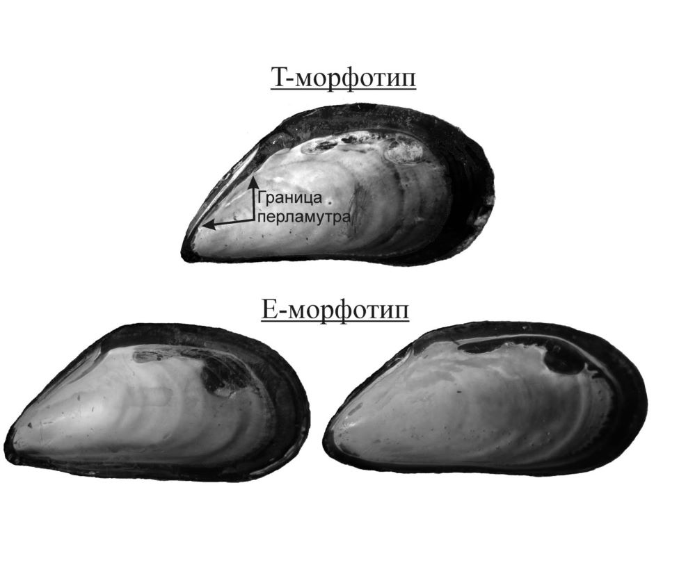
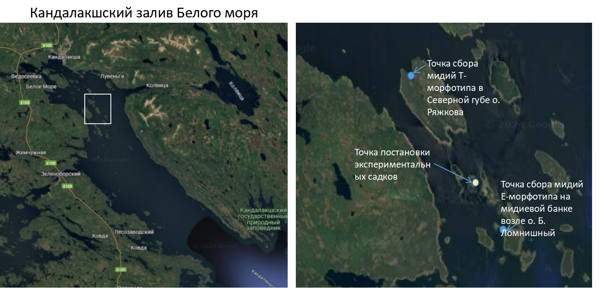

---
output:
  word_document:
    reference_docx: style_for_RMD.docx
bibliography: Беляева_литература.bib
csl: meps.csl
editor_options: 
  chunk_output_type: console
---

```{r setup, include=FALSE}
library(knitr)
opts_chunk$set(echo = FALSE, message = FALSE, warning = FALSE)
```


```{r cars}
library(readxl)
library(dplyr)
library(ggplot2)
library(mgcv)
library(gratia)
library(broom)


```
 
```{r}
theme_set(theme_bw())
```
 
 
 
# Эколого-биологический центр “Крестовский остров”

# Лаборатория Экологии Морского Бентоса

# (гидробиологии)

 


 

# О. Беляева

# Совместная жизнь двух видов беломорских мидий (*Mytilus edulis* Linnaeus, 1758 и *Mytilus trossulus* A. Gould, 1850) делает их более уязвимым для хищников (Asterias rubens Linnaeus, 1758)

 

# Санкт-Петербург

# 2024

\newpage
 
 
###### Естественные поселения беломорских мидий *Mytilus edulis* (*Me*) и *Mytilus trossulus* (*Mt*) подвергаются атакам морских звезд (*Asterias rubens*). Выбор жертвы морскими звездами в смешанном поселении двух видов мидий может зависеть от разных стратегий формирования защитных механизмов жертв. Хищнику энергетически выгодно атаковать жертву, на обработку которой уйдет минимально времени при максимальной получаемой энергии. Мы предположили, что сосуществование двух конкурирующих видов мидий в смешанных поселениях препятствует проявлению в полной мере внутривидовой кооперации,  направленной на защиту. Из этого мы выдвинули гипотезу, что гибель жертв в смешанных поселениях должна быть более интенсивной по сравнению с одновидовыми поселениями мидий. Для проведения эксперимента  были собраны садки, в которые мы высадили по 80 моллюсков в разных соотношениях видов. После формирования агрегаций мидий, садки были опущены в сублитораль в место скопления морских звезд. Через 3 дня экспозиции оказалось, что наибольшая биомасса звезд и  самая большая доля съеденных моллюсков приходятся на садки, где соотношение двух видов мидий было близко к 1:1. В садках, где преобладали *Me* или *Mt* смертность моллюсков была ниже. Это может быть связно с тем, что поселения смешанного типа становятся более “пористыми”, что облегчает морским звездам доступ к жертвам.  
 
# Введение 

Организмы, обитающие в сообществе, связаны между собой разнообразными связями, в том числе трофическими взаимоотношениями [@beclemichev1951classification]. Частный случай трофический взаимоотношений - взаимодействия хищника и жертвы. При этом считается, что поведение хищника подчиняется модели оптимального фуражирования [@smith_15_6]. Эта модель утверждает, что животное стремится максимизировать за единицу времени количество энергии, которую оно получает из пищи. Ключевой параметр для этой модели, время обработки пищи, во многом зависит от наличия у жертвы защитных приспособлений [@smith_15_10]. Если такие приспособления присутствуют, то это увеличивает время обработки и, следовательно, уменьшает количество энергии, полученной за единицу времени. Таким образом, чем меньше защитных приспособлений вырабатывает жертва, тем выше вероятность быть съеденной. Одним из хорошо исследованных примеров взаимодействия хищника и жертвы является система, где хищником оказываются морские звезды, а жертвами - двустворчатые моллюски мидии [@macaracheva2016factors; @khaitov2023predators]. Известно, что звезды активно поедают мидий, уничтожая достаточно большие поселения, вплоть до обширных мидиевых банок [@khaitov2023predators]. 


 В ответ на присутствие хищника мидии развивают различные защитные механизмы. Так моллюски могут утолщать раковину, и изменять ее размерные характеристики, увеличивать массу мускула замыкателя, повышать выделение биссусных нитей [@smith2000induced; @fassler2008phylogenetically; @lowen2013predator]. При этом было показано, что морским звездам сложнее питаться в тех поселениях мидий, где моллюски, скрепляясь друг с другом, формируют плотные агрегации [@dolmer1998interactions]. В таких агрегациях связи между мидиями затрудняют добычу и обработку жертвы, в то время как в поселениях, где эти соединения или ориентация мидий нарушены, шансы уcпешной атаки хищника возрастают [@dolmer1998interactions]. 

 Взаимоотношения мидий и морских звезд становятся более сложными в тех случаях, когда в одном поселении представлены два (или более) криптических вида жертв, которые могут иметь разные защитные механизмы. Так, например, в морях Северной Атлантики совместно обитают два криптических вида рода *Mytilus*: *Mytilus edulis Linnaeus, 1758* и *Mytilus trossulus A. Gould, 1850* [@vainola2011mytilus]. Мидии живут либо в моноспецифичных поселениях, например, во внутренней части Балтики обитают, в основном, *M.trossulus*, а за Датскими проливами - *M.edulis* [@vainola2011mytilus]. В ряде случаев в одной географической локации присутствуют оба вида, формируя смешанные, с разными долями того или иного вида, поселения. Такая картина наблюдается,  например, в Северном, Белом и Баренцево морях [@vainola2011mytilus], а также на Атлантическом побережье Северной Америки [@riginos2005invited]. В таких смешанных поселениях морские звезды *Asterias rubens Linnaeus, 1758* охотнее нападают на *M.trossulus* [@lowen2013predator;@khaitov2021species;@macaracheva2015].Этот выбор может объясняется тем, что в ответ на присутствие морской звезды *M.edulis* лучше способны к обороне, чем *M.trossulus*. Эта лучшая приспособленность проявляется за счет увеличения толщины стенки раковины, усиления мышцы-аддуктора, повышения выделения биссуса или уплотнения агрегаций [@lowen2013predator]. Однако, следует отметить, что все эти реакции требуют от мидий долговременного (более месяца) контакта с хищником [@lowen2013predator], что в природных условиях практически нереалистично. Поэтому более вероятным является другое объяснение, которое заключается в том, что у двух видов мидий створки раковины имеют разную толщину, а, следовательно, и разную гибкость [@beaumont2008three;@kirillov2015]. Раковины *M.trossulus* более тонкие и более гибкие, а поэтому звездам легче их вскрывать, растягивая створки [@khaitov2021species]. Однако, вне зависимости от того какой механизм лежит в основе неравнозначных предпочтений со стороны морских звезд по отношению к двум  видам жертв, можно утверждать, что *M.edulis* лучше приспособлены к влиянию хищников, чем *M.trossulus*.  

Учитывая наблюдаемую асимметрию, мы можем ожидать, что максимальная вероятность атаки морскими звездами будет в моноспецифичных поселениях *M.trossulus*, а минимальной - в моноспецифичных поселениях *M.edulis*. В смешанных поселениях можно ожидать, что морские звезды будут выедать преимущественно *M.trossulus*. То есть вероятность атаки морских звезд на поселение должна возрастать с увеличением в нем доли *M.trossulus* [@macaracheva2017]. 

Однако, такая модель не соответствует наблюдениям. Так, однозначной положительной корреляции между вероятностью гибели мидий и долей *M.trossulus* в поселении, как предсказывает модель, описанная выше, найдено не было [@khaitov2023predators]. Более того, было показано, что звезды чаще атакуют тот вид жертв, относительное количество которого в агрегации меньше, будь то *M.trossulus* или *M.edulis* [@macaracheva2016factors;@khaitov2023predators]. То есть атакам подвергаются в первую очередь мидии «аутсайдеры». Авторы этих наблюдений предполагают, что в основе выбора звездами жертвы лежит то, как мидии агрегируются друг с другом [@khaitov2023predators]. Известно, что два вида мидий заметно отличаются в своей стратегии формирования агрегаций: *M.trossulus* предпочитает покрепче прикрепиться к донному субстрату, в то время как *M.edulis* имеет тенденцию к формированию многослойных поселений, в которых моллюски крепятся друг к другу [@khaitov2024]. Особенно ярко эти различия проявляются при наличии химических сигналов, исходящих от хищников [@kirillov2015]. Если эта модель верна, то из нее можно вывести два проверяемых следствия. Во-первых, можно ожидать, что мидии, живущие в моноспецифичных поселениях, должны быть наименее подвержены атакам звезд, а мидии в смешанных поселениях должны демонстрировать наибольшую смертность. Во-вторых, если хищники активно выбирают не столько вид жертв, сколько тип поселения, то обилие морских звезд, кормящихся на поселениях мидий, должно быть максимальным в смешанных поселениях двух видов.  Цель данной работы – проверить выполняются ли эти предсказания в условиях эксперимента. 

```{r pressure, echo=FALSE}

```

# Материалы и методика


## Идентификация мидий 


Для надежного определения вида моллюска необходимо проведение генотипирования, однако, как было показано в работе В.М.Хайтова и соавторов [@khaitov2021species] генетически определенный вид коррелирует с так называемым морфотипом мидии. Беломорские *M.edulis* и *M.trossulus* различаются по следующему конхологическому признаку: наличием или отсутствием непрерывной полосы призматического слоя под нимфой лигамента на внутренней стороне раковины (рис. 1). Выделяется два разновидности мидий, коррелирующие с видами [@khaitov2021species]. Первая разновидность, T-морфотип, имеет описанную полоску и с высокой вероятностью соответствует *M.trossulus*. Вторая форма, E-морфотип, характеризуется отсутствием полоски призматического слоя и с высокой вероятностью соответствует *M.edulis*. 


```{r, fig.cap="Рисунок 1. Морфотипы беломорских мидий"}

```

 

## Сбор животных для эксперимента   


Материал для проведения эксперимента был собран в августе 2024 года. Мидии T-морфотипа были собраны в Северной губе острова Ряжкова, где по результатам исследований наблюдается высокая доля мидий этой разновидности. Вторая точка сбора-мидиевая банка на остове Большой Ломнишный, на ней были собраны мидии E-морфотипа, которые, по ранее проведенным исследованиям, преобладают в этой точке. 

 



 

Для увеличения вероятности нахождения мидии нужного морфотипа, моллюски были дополнительно отобраны с помощью теста, предложенного в работе Э.Бюмона с соавторами [@beaumont2008three]. Мидии подвергались сжатию в спинно-брюшном направлении: у *M.trossulus*, обладающих более тонкой раковиной, при этом появляется широкая щель между створками раковины, у *M.edulis*, обладающих более толстыми створками, такая щель не образуется. 

До эксперимента мидии были выдержаны в сетках, свешeнных в морскую воду, не менее 2-3 дней. Для эксперимента были отобраны мидии размером 15-30 мм. 

## Проведение эксперимента 

Были подготовлены 33 садка из керамической плитки 25х25 см и пластикового бортика высотой 3 см (аналогичная конструкция была использована в предыдущих работах, см. [@macaracheva2017]). На каждом садке был подписан тип, соответствующий соотношению разных морфотипов в садке, и индивидуальный номер. В каждый садок было высажено по 80 мидий в разных соотношениях. В 11 садков было высажено по 80 мидий с точки сбора №1 (мы рассматривали эти садки, как чистые поселения мидий T-морфотипа). Далее этот тип садков будем обозначать, как “80T”. В следующие 11 садков мы посадили по 40 мидий с точки сбор №1 и по 40 мидий с точки сбора №2 (этот тип садков мы рассматривали, как смешанные поселения). Далее этот тип поселения будет обозначаться, как “40/40”. В последние 11 садков было высажено по 80 мидий с точки сбора №2 (чистые поселения мидий E-морфотипа). Далее этот тип садков будет обозначен, как “80E”.  

Перед началом эксперимента садки были закреплены с помощью деревянных колышков в литоральной луже о. Ряжкова и оставлены там на 3 дня. Несмотря на то, что лужа находится в затишных условиях, в дни нахождения там садков был сильный ветер и волны, что привело к частичной утере не успевших закрепиться биссусом мидий. За время нахождения в луже мидии успели закрепиться биссусом и сформировать друзы. После этого периода садки были перевезены на место постановки эксперимента.  

Эксперимент был поставлен в окрестностях островов Девичья Луда и Первая Поперечная Луда (рис. 2). Садки с привязанными к ним поплавками, маркирующими положение садка, были опущены на дно с помощью водолаза, который располагал их на глубине около 2 м в случайном порядке. Визуальные наблюдения показали, что в месте постановки садков находилось скопление звезд Asterias rubens.  

Экспериментальные установки экспонировались в течение 3 дней (с 13.08.2024 по 16.08.2024). После периода экспозиции установки были подняты вместе с наползшими на них морскими звездами. При транспортировке садков в лабораторию они находились без воды, что препятствовало активности звезд.  

## Обработка материала  

Сразу после доставки материала в лабораторию, звезды и моллюски с каждой из пластин были рассажены в разные контейнеры. У звезд был измерен вес (с точностью до 0.001 г) , после чего животные были выпущены в море. 

Створки мидий, съеденных хищниками, были высушены, живых мидий мы сварили и очистили от мягких тканей, после чего их створки также были высушены. Далее в обработке материала участвовали только правые створки (если правая створка была повреждена и определить морфотип по ней не представлялось возможным, в таком случае использовалась левая створка). У каждой раковины мы измерили с помощью штангенциркуля длину, с точностью до 1 мм (L) и определили морфотип.  

## Статистическая обработка 

Обработка проводилась с помощью языка статистического программирования R [@Rlanguage].  

Для оценки распределения морских звезд по садкам мы построили бокс-плоты, отражающие варьирование биомассы звезд, заползших в садки разных типов. Биомассу мы рассчитывал как сумму индивидуальных весов всех морских звезд, обнаруженных на экспериментальной пластине.  

Для анализа связи вероятности гибели мидий с биомассой звезд мы вычислили для каждого садка долю мертвых моллюсков в общем количестве мидий, найденных в садке. Эту величину мы сопоставили с биомассой звезд, построив точечную скеттер-диаграмму.     

Для анализа связи вероятности гибели индивидуальной мидий с видовым составом поселений, в котором существовал моллюск, мы решили ввести более точную характеристику таксономической структуры поселения, нежели тип садка. Для каждого садка мы вычислили долю численности моллюсков T-морфотипа в общей численности мидий, найденных в пределах садка после окончания эксперимента. Для вычисления этой характеристики мы сложили обилие всех живых и съеденных моллюсков T-морфотипа, найденных в пределах данного садка, и разделили на общее количество живых и мертвых мидий в том же садке. Эта величина (далее Prop_T) была использована в качестве предиктора для построения регрессионной модели (см. ниже). Вторым предиктором в этой модели был индивидуальный размер моллюсков.   


# Результаты 


```{r Подготовка_данных}

astred <- read_excel("Data/Astred24.xlsx", na = "NA", sheet = "Mussel")

astred <-
astred %>% 
  filter(!is.na(Type))


cage_param <- 
astred %>%
  group_by(Type, Cage_ID) %>% 
  summarise(Prop_T = mean(Morphotype == "t"), 
            Prop_Dead = mean(Status == "dead"),
            N = n()) 


arubens <- read_excel("Data/Astred24.xlsx", na = "NA", sheet = "Asterias rubens")

df <-
arubens %>%
  group_by(Type, Cage_ID) %>% 
  summarise(B = sum(W), Abund = n()) 

cage_param <-
merge(cage_param, df, all.x = T)


cage_param$Type <- factor(cage_param$Type, levels = c("80E", "40/40", "80T"))


individual_fate <-
merge(astred, cage_param, all.x = T)


individual_fate$Out <- ifelse(individual_fate$Status == "dead", 1,0)

individual_fate$Morphotype <- factor(individual_fate$Morphotype)

individual_fate$Cage_ID_2 <- paste(individual_fate$Type, individual_fate$Cage_ID, sep = "_")

individual_fate$Cage_ID_2 <- factor(individual_fate$Cage_ID_2)


```

Количество мидий (живых и мертвых), обнаруженных в садках трех типов варьировало от  53 до 97 особей. При этом по садкам разных типов количество мидий, обнаруженных в конце эксперимента, было распределено достаточно закономерно (Рис. 3). В среднем, меньше всего моллюсков было найдено в садках “80E”, чуть больше - в садках “40/40”, и самое большое количество мидий было представлено в садках “80T”.  В 4 садках было обнаружено больше мидий, чем было изначально высажено (81, 83, 85 и 97 особей). Все они относились к садкам типа “80T”.

 

```{r рисунок_финальная_численность, fig.cap= "Рисунок 3. Финальная численность моллюсков (живых и мертвых) в садках трех типов." }

ggplot(cage_param, aes(x = Type, y = N)) +
  geom_boxplot() +
  labs(x = "Тип садка", y = "Финальная численность моллюсков")

```

 

На рисунке 4 приведена зависимость биомассы морских звезд от типа садка (тип садка определяется долей T-морфтипа в садке). Можно заметить, что наибольшая биомасса звезд приходиться на садки со смешанными поселениями, в то время как на моноспецифичных поселениях биомасса звезд меньше.


```{r рисунок_биомасса_звезд, fig.cap= "Рисунок 4. Боксплоты, отражающие биомассу морских звезд в садках трех типов: Садки с преобладанием Е-морфотипа (80Е), с преобладанием Т-морфотипа (80Т) и садки смешанного типа (40Е и 40Т) " }

ggplot(data = cage_param, aes(x = Type, y = B)) +
  geom_boxplot(aes(fill = Type)) +
  guides(fill = "none") +
  labs(x = "Тип садка", y = "Биомасса морских звезд")

```

 

Доля мертвых моллюсков, обнаруженных в садках после окончания эксперимента находилась в явной положительной зависимости от биомассы звезд (Рис. 5).  

```{r рисунок_биомасса_зыезд_доля_мертвых, fig.cap= "Рисунок 5. Зависимость между долей съеденных моллюсков (Prop_T)  и биомассой морских звезд (B)." }

ggplot(data = cage_param, aes(x = B, y = Prop_Dead)) +
  geom_point(aes(color = Type), size = 4)+
  labs(x = "Биомасса звезд", y = "Доля мертвых мидий")


```

 

Моделирование зависимости между вероятностью быть съеденной и таксономической структурой (Prop_T), размером моллюска (L) и финальной численностью мидий в садках (N), выявило статистически значимую связь вероятности гибели мидий со всеми изученным предикторами (Табл. 1).  


```{r модель}

Mod_all1 <- gam(Out ~ s(Prop_T, bs = "cs", k = 5)  + s(Size) + s(N), data = individual_fate, family = binomial(link = "logit"))

```

 

```{r Summary_Model}

kable(tidy(Mod_all1),
      caption = "Таблица 1. Параметры сглаживающих функций для модели, описывающей связь вероятности быть съеденой в зависмости от таксономического состава поселения (Prop_T), раазмера мидий (Size) и финальной числености моллюсков (N).")

```

 

Данные, приведенные в таблице 1 позволяют заметить, что связь между вероятностью гибели носит криволинейный характер в случае влияния Prop_T и N (параметр edf > 1).


```{r fig.cap="Рисунок 6. Зависимость между вероятностью быть съеденной для мидий в зависимости от таксономической структуры (доля мидий T-морфотипа, Prop_T), размера моллюсков (L) и численности мидий, обнаруженных в садках в конце эксперимента (N).", fig.width=9}
#Картинка


Pl_1 <- draw(Mod_all1, select = c(1)) 

Pl_2 <- draw(Mod_all1, select = c(2))

Pl_3 <- draw(Mod_all1, select = c(3))


library(cowplot)

plot_grid(Pl_2, Pl_3, Pl_1, nrow = 1, labels = "AUTO")
```

 
 
Рисунок 6 отображает зависимость вероятности гибели от таксономического состава поселения (доля Т-морфотипа, Prop_T). Согласно полученной модели, наибольшая вероятность быть съеденными у мидий, находящихся в смешанных поселениях, соотношение морфотипов в которых близко к 50:50. В «чистых» поселениях, где преобладают мидии E-морфотипа (низкое значение Prop_T) или T-морфотипа (высокое значение Prop_T) вероятность гибели существенно ниже.  

Зависимость доли мертвых мидий от их размера (рис. 6) линейна (edf = 1, табл. 1): чем больше размер моллюска, тем меньше у него вероятность быть съеденным. Исходя из этого, можно сказать, что морские звезды предпочитают атаковать более мелких мидий. 

Связь доли мертвых мидий c финальной численностью моллюсков (N) отображена на рисунке 6. Максимальная доля мертвых приходится на садки со средним количеством мидий. При увеличении или уменьшении количества мидий в садке вероятность быть съеденной падает. 

# Обсуждение 

Проведенное исследование показало, что вероятность гибели мидий от морских звезд зависит от размера жертвы. Звезды чаще атакуют более мелких мидий. Этот результат полностью совпадает с результатами предыдущих работ, где была показана аналогичная связь с размером жертвы [@macaracheva2015;@khaitov2021species]. Вероятно, такая зависимость определятся  тем, что более тонкие створки раковины мелких моллюсков проще растянуть с помощью амбулакральных ножек, следовательно, на это затрачивается меньше энергии и времени. 

Еще одна связь, найденная в нашей работе, это зависимость вероятности быть съеденной от количества мидий в садке. В предыдущие работе была выявлена отрицательная связь вероятности быть съеденной с численностью мидий, представленных в садках. В нашей работе мы выявили более сложную закономерность. Несмотря на то, что количество моллюсков, высаженных на пластины, строго контролировалось (изначально везде было высажено по 80 особей), финальная численность варьировала. Эта вариация, вероятно, связана с двумя типами факторов. Во-первых, имели во время нахождения садков с моллюсками в литоральной луже наблюдалось значительное усиление ветра и волн, несмотря на затишные условия лужи, вероятно некоторым моллюсков вымыло волнами, также, возможно. моллюсков могло перебросить из одного садка в другой. Во-вторых, это могут быть биологические причины. Возможно, мидии, в ответ на присутствие хищника, способны достаточно активно от него убегать, покидая садок. Также возможно, что звезды могут "выбрасывать" створки съеденных мидий, в том числе и за пределы садка.  Вследствие этой вариации появилась возможность оценить влияние численности моллюсков на пластине на вероятность быть съеденной. Наиболее вероятным оказалось уничтожение жертв в садках со средней финальной численностью. Для мидий, обитавших в садках при более высокой и более низкой численности вероятность быть съеденной была ниже.  Можно предположить, что это также объясняется моделью оптимального фуражирования: среднего размера поселения являются наиболее энергетически выгодными, в то время как в маленьких поселениях снижается количество получаемой энергии, а в больших поселениях увеличивается время на обработку моллюсков (в связи с более плотными и обширными агрегациями). 

Последняя группа результатов данной работы подтверждает гипотезу, выдвинутую в предыдущих работах [@khaitov2023predators;@macaracheva2016factors]: морские звезды предпочтительнее атакуют садки со смешанными поселениями. На таких поселениях было отмечено большее обилие хищников. То есть морские звезды, видимо, могут распознавать наиболее «выгодные» скопления жертв. На данном этапе нельзя с уверенностью сказать каков механизм увеличения биомассы звезд на пластинах со смешанными поселениями. С одной стороны, звезды могут целенаправленно сползаться в такие поселения. С другой стороны, возможно, что звезды сползаются на все садки одинаково, но остаются в основном на смешанных поселениях. Мы выявили, что чем больше биомасса звезд, тем больше доля съеденных мидий. Это совпадает с результатами предыдущих работ [@khaitov2023predators]. Такая корреляция имеет вполне очевидные биологические механизмы: чем больше обилие хищников, тем выше вероятность быть съеденными для жертв. 

Вероятность быть съеденной, как и предсказывает гипотеза, которую мы проверяли, имела нелинейную связь с таксономической структурой поселения мидий. Наиболее высокая вероятность гибели была отмечена в садках, где мы моделировали смешанные поселения. Мы предположили, что это в первую очередь связано с различными стратегиями формирования агрегаций. Формирование агрегаций является одним из механизмов защиты от хищников у моллюсков [@dolmer1998interactions]. При этом стратегия прикрепления к субстрату и формирования агрегаций у *M.trossulus* и *M.edulis* различаются. Было показано, что при формировании поселений *M.trossulus* предпочитает покрепче прикрепиться к донному субстрату, но не к раковинам соседних мидий, в то время как *M.edulis* имеет тенденцию к формированию многослойных поселений, в которых моллюски крепятся друг к другу [@khaitov2024]. Возможно именно этим и объясняется более интенсивная убыль моллюсков в садках типа “80E” вследствие волнового воздействия, которую мы наблюдали. Меньше всего волны выбили мидий из садков типа “80T”, возможно за счет того, что *M.trossulus*, в основном представляющие данный тип садков, плотно крепятся ко дну садка и волнами их не отрывает, а *M.edulis* крепятся друг к другу и очень слабо ко дну садка, следовательно, такие друзы легко отрываются и выносятся. Однако такое многослойное скопление делает тех моллюсков, которые попали в центр агрегации, менее уязвимыми для хищников.   

Иная картина наблюдается, вероятно, когда формируются агрегации в смешанных поселениях. Оба вида не могут в полной мере реализовать свою стратегию прикрепления, вследствие чего смешанные поселения получаются более “пористыми”, мидии менее плотно прилегают друг к другу, что снижает время, затраченное морскими звездами обработку добычи, так как до моллюска проще добраться. Однако для доказательства данного предположения, требуется проведение дополнительных экспериментов и наблюдений. 

# Благодарности 

Я выражаю огромную благодарность моему научному руководителю В. М. Хайтову и всем участникам LIX Беломорской экспедиции. Особо я благодарна  А. Е. Горных, за проведение водолазных работ. Я признательна сотрудникам Кандалакшского заповедника за неоценимую помощь и поддержку на всех этапах работы.

# Литература