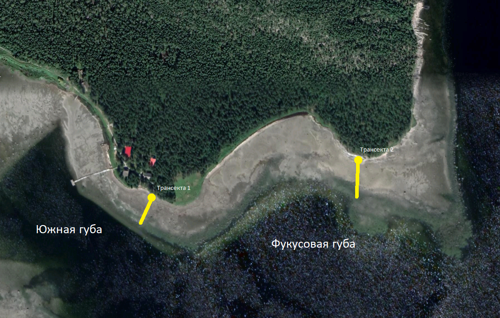

```{r setup, include=FALSE}
library(knitr)
opts_chunk$set(echo = FALSE, warning = FALSE, message = FALSE)
options(knitr.kable.NA = '')
```


```{r packages}

library(readxl)
library(ggplot2)
library(dplyr)
library(broom)
library(clipr)
library(bibtex)
library(reshape2)
library(mgcv)
library(gratia)
library(lme4)
library(performance)
library(cowplot)

```

# Эколого-биологический центр “Крестовский остров”

# Лаборатория Экологии Морского Бентоса

# (гидробиологии)

&nbsp;

&nbsp;


&nbsp;

# А. Бритиков

# Разделение каких экологических ниш Littorina saxatilis и L. obtusata мы наблюдаем на литоррали Белого моря?

&nbsp; 

&nbsp; 

# Санкт-Петербург    
# 2024

\newpage

# Введение

  Экологическая ниша - это многомерное пространство, формируемое условиями и ресурсами, которые обеспечивают существование видов, влияя на то, как виды сосуществуют и разделяются, используя различные ресурсы и условия окружающей среды для снижения конкуренции (@reyes2024all). Дифференциация на специфические ниши включает пространственную, трофическую, временную и/или их комбинацию (@guo2012separation).
  
  Адаптивная диверсификация сложных признаков играет ключевую роль в эволюции разнообразия организмов. У пресноводных улиток рода Tylomelania адаптивные радикации, вероятно, способствовала трофическая специализация через диверсификацию их ключевого кормового органа - радулы (@hilgers2022evolutionary). 
  
$ В исследование Гуо места обитания, особенности жизненного цикла, состав пищи и кормовое поведение двух видов.
и кормовое поведение двух инвазивных видов гобиид,
и экологически сходных (Rhinogobius cliffordpopei и Rhinogobius giurius).
Rhinogobius giurinus), сравниваются, чтобы проверить, является ли разделение ниш
потенциально может обеспечить их стабильное сосуществование в озере Эрхай (мелководное озеро). $
  

# Материалы и методика

## Место сбора

  Работа проводилась на территории Кандалакшского заповедника на острове Ряжков. Непосредственный сбор материалов происходил на илисто-песчаной литорали Южной губы (координаты точки сбора 667°00'27.2"N 32°34'34.4"E) и на литорали около скальных выходов (координаты точки сбора 67°00'27.6"N 32°35'07.5"E) (рис. +++).
  
  

  По малой воде мы заложили две трансекты - колышки расположенные в одну линию через определенное расстояние. Одну - на литорали Южной губы (трансекта 1), другую на литорали у скальных выступов (трансекта 2). На первой трансекте было сделано двенадцать разрезов, с промежутками между колышков в 5 метров, на второй - девять, с промежутком между колышками в 10 метров, кроме трех последних, расстояние между которыми было 5 метров.
  
  Используя рамку 1/40 квадратного метра нами было взято по три рамки на один колышек на первой трансекте и по 5 рамок на каждый колышек второй трансекты. Из каждой рамки мы выбирали всех моллюсков вида L.saxatilis и L.obtusata. Обтузат мы определяли по округлой форме раковины, маленьким и часто расположенным продольным бороздкам на раковине и запаяным швам между завитками раковины. Саксатилис мы различали по Вытянутой раковине с более крупными и более редкими, чем у обтузат, продольными бороздами и вдавленным швам между завитками раковины. Этих улиток мы подсчитывали, чтобы понять распределение этих двух видов в зависимости от высоты литорали. Высоту, на которых находились колышки мы определяли с помощью водяного уровня.

## Проведение эксперимента

  Чтобы проверить возможную причину разделения, связанную с разницей пищевых объектов на 
  
## Статистическая обработка

  В качестве зависимой переменной в статистическом анализе мы использовали количество фекалий (пеллет) выделенных моллюсками (Pell).Для каждой из этих переменных были построены линейные модели, отражающие связь с двумя предикторами (“Статус моллюска” и “Размер устья”) и их взаимодействием. На основе дисперсионного анализа полученных моделей принималось решение о статистической значимости влияния того или иного фактора. В качестве порогового значения для отвержения нулевой гипотезы использовался уровень значимости α=0,05. Все расчеты проводились с использованием функций языка статистического программирования R 4.4.2 (R Core Team, 2024).


# Результаты

# Обсуждение

# Выводы

```{r}
lit <- read_excel("Tables/Pelets_2024.xlsx", sheet = "ОБилие литторин на уровнях")


lit$Site <- factor(lit$Site)

names(lit)

lit_long <-
melt(data = lit, id.vars = c("Date", "Description", "Site", "Sampling_Level", "Real_H", "Sample"), variable.name = "Species", value.name = "N")


lit_long %>% 
  group_by(Site, Species, Real_H) %>% 
  summarise(N = mean(N)) %>% 
  ggplot(aes(x = Real_H, y = log(N + 1), color = Species)) +
  geom_point(size = 4) +
  geom_smooth(se = F)  
  facet_wrap(~Site)


  

Mod <- gam(log(N+1) ~ s(Real_H, bs = "cr", by = Species, k = 7) + Species, data = lit_long)

# Mod <- gam(N ~ s(Real_H, bs = "cr", by = Species, k = 7) + Species, family = "nb", data = lit_long)


  
# summary(Mod)
# 
# appraise(Mod)  

Pl_Ls <-
draw(Mod, residuals = T, select = 1) +
  geom_vline(xintercept = 189,4) +
  theme_bw()

Pl_Lo <-
draw(Mod, residuals = T, select = 2) +
  geom_vline(xintercept = 189,4) +
  theme_bw()


```


```{r}

plot_grid(Pl_Ls, Pl_Lo)

```


```{r}
pel <- read_excel("Tables/Pelets_2024.xlsx")

pel %>%  
  filter(Type == "Wild") %>% 
  ggplot(aes(x = Substrate, y = Pell, fill = Species)) +
  geom_boxplot()

pel %>%  
  filter(Type == "Caged") %>% 
  ggplot(aes(x = Substrate, y = Pell, fill = Species)) +
  geom_boxplot()


pel %>%  
  filter(Type == "Caged") -> pel_caged


Mod_pel <- glmer.nb(Pell ~ Species * Substrate + (1|Experiment),  data = pel_caged)

plot(Mod_pel)

summary(Mod_pel)


overdisp_fun <- function(model) {
rdf <- df.residual(model)
rp <- residuals(model,type="pearson")
Pearson.chisq <- sum(rp^2)
prat <- Pearson.chisq/rdf
pval <- pchisq(Pearson.chisq, df=rdf, lower.tail=FALSE)
c(chisq=Pearson.chisq,ratio=prat,rdf=rdf,p=pval)
}

overdisp_fun(Mod_pel)

```


