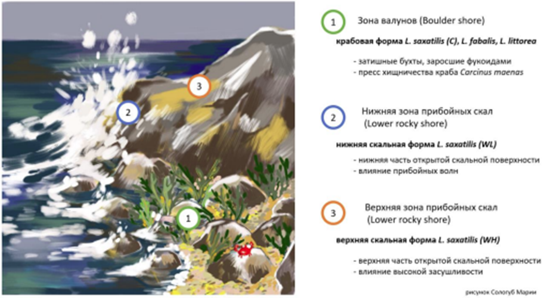

```{r setup, include=FALSE}
library(knitr)
opts_chunk$set(echo = FALSE)
```

## О чем работа?

```{r, out.width = "800px", out.height= "450px", fig.cap="Схема расположения моллюсков рода Littorina в соответствии с занимаемыми биотопами."}


```


## Общее положение


```{r, out.width = "200px", out.height= "50px"}


```


'lsx'SAD[a
dlc';Aksajdaspiasfpvkapvkpo

## Slide w

- Bullet 1
- Bullet 2
- Bullet 3

## Slide with R Output

```{r cars, echo = TRUE}
summary(cars)
```

## Slide with Plot

```{r pressure}
plot(pressure)
```

