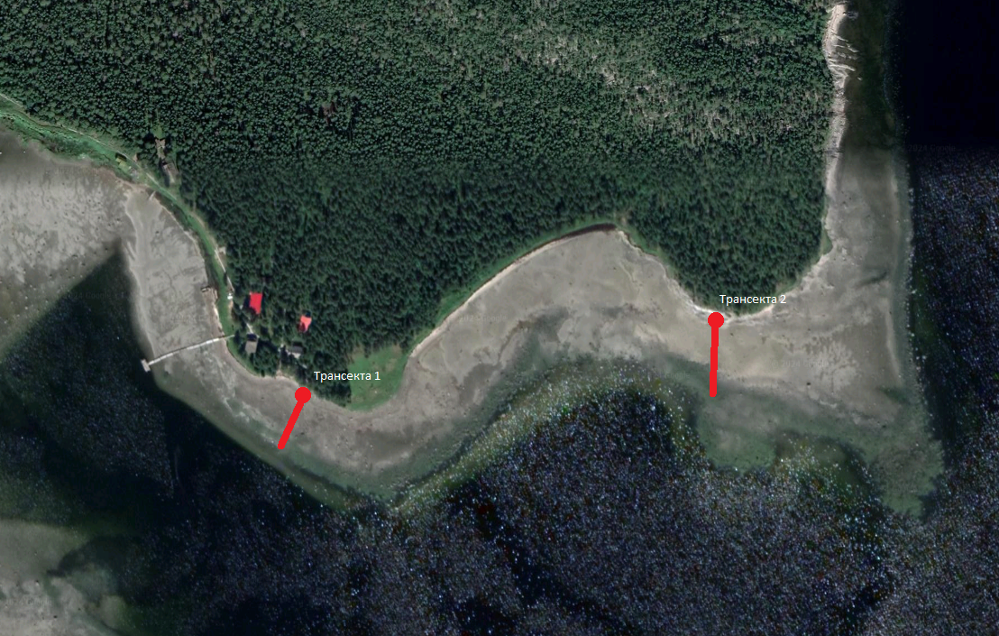
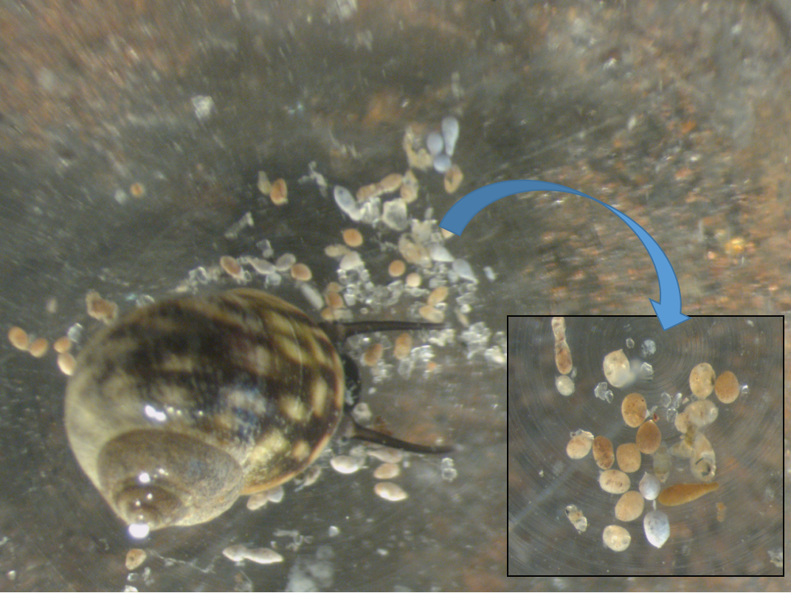

```{r setup, include=FALSE}
library(knitr)
opts_chunk$set(echo = FALSE, warning = FALSE, message = FALSE)
options(knitr.kable.NA = '')
```


```{r packages}
library(readxl)
library(ggplot2)
library(dplyr)
library(broom)
library(clipr)
library(bibtex)
library(reshape2)
library(mgcv)
library(gratia)
library(lme4)
library(performance)
library(cowplot)
library(ggsignif)
library(multcomp)
```


# Эколого-биологический центр “Крестовский остров”

# Лаборатория Экологии Морского Бентоса

# (гидробиологии)

&nbsp;

&nbsp;


&nbsp;

# А. Бритиков

# Разделение каких экологических ниш Littorina saxatilis и L. obtusata мы наблюдаем на литорали Белого моря?

&nbsp; 

&nbsp; 

# Санкт-Петербург    
# 2024

\newpage

# Введение

  Экологическая ниша - это многомерное пространство, формируемое условиями и ресурсами, которые обеспечивают существование видов.
  
  , влияя на то, как виды сосуществуют и разделяются, используя различные ресурсы и условия окружающей среды для снижения конкуренции (@reyes2024all). Дифференциация на специфические ниши включает пространственную, трофическую, временную и/или их комбинацию (@guo2012separation).
  
  У пресноводных улиток рода *Tylomelania* адаптивная радиация, вероятно, способствовала трофическая специализация через диверсификацию их ключевого кормового органа - радулы (@hilgers2022evolutionary).   
  
  
  
  Так в работе Гуо @guo2012separation, было показано, на примере бычков *Rhinogobius cliffordpopei* и *Rhinogobius giurius*, разделение экологических ниш двумя схожими вида в пространстве, времени и пищевых объектах. 
  
  
  Понимание как похожие между собой виды разделяют свои экологические ниши, имеет решающее значение для понимания эволюционных процессов, приспособляемости видов к разнообразным условиям среды и механизмов, определяющих биоразнообразие. Это позволяет разрабатывать стратегии сохранения и прогнозировать реакцию на изменения окружающей среды в экосистемах (@cooper2024ecological).
  
  В данном исследование изучалось разделение экологических ниш между двумя вида моллюсков: *L.saxatilis* (далее саксатилис) и *L.obtusata* (далее обтузата). Понимание различий в экологических нишах между *L.saxatilis* и *L.obtusata* очень важно, поскольку оно показывает, как экологическая диверсификация смягчает межвидовую конкуренцию, способствует эффективной эксплуатации ресурсов и вносит вклад в процесс экологического видообразования в симпатрических популяциях (@maltseva2021linking). Целью данной работы было оценить расхождение ареалов обитания *Littorina saxatilis* и *Littorina obtusata* и установить возможные причины такого разделения. В задачи исследования входило: определить, как в зависимости от высоты меняется процентное соотношение этих двух видов моллюсков и какие могут быть причины такого разделения экологических ниш.

# Материалы и методика

## Место сбора

  Работа проводилась на территории Кандалакшского заповедника на острове Ряжков. Непосредственный сбор материалов происходил на илисто-песчаной литорали Южной губы (координаты точки сбора 667°00'27.2"N 32°34'34.4"E) и на литорали Фукусовой губы около скальных выходов (координаты точки сбора 67°00'27.6"N 32°35'07.5"E) (рис. +++).
  
  

## Эксперимент №1

  В этом эксперименте подсчитывали число число моллюсков на разных уровнях литорали. Это нужно, чтобы оценить соотношение Lo и Ls на разных уровнях литорали.

  По малой воде мы заложили две трансекты - колышки расположенные в одну линию через определенное расстояние. Одну - на литорали Южной губы (трансекта 1), другую на литорали Фукусовой губы у скальных выступов (трансекта 2). Первая трансекта была поделена на двенадцать уровней. Первый уровень был отмечен колышком, находящимся на высоте 145,9 метров над нульом глубин. Все последующие колышки находились на расстоянии 5 метров. Вторая трансекта была поделена на девять уровней. Первый колышек второй трансекты находился на высоте 72,3 метра над нульом глубин. Промежуток между колышками составлял 10 метров, кроме трех последних, расстояние между которыми было 5 метров. Для взятия проб использовалась рамка 1/40 метра квадратного.
  
  Из каждой рамки мы выбирали всех моллюсков Ls и Lo. *Littorina saxatilis* и *Littorina obtusata* мы определяли по. Высоту, на которых находились колышки, а следовательно и рамки, мы определяли с помощью водяного уровня. Представителей этих двух видов мы различали по форме раковин и ее поперечной исчерченности.

  Высоту между уровнями трансекты мы различали с помощью сообщающихся сосудов. Стометровая, силиконовая, прозрачная трубка привязывалась к размеченной метровой палке. Через воронку, закрепленную на конце, мы наливали в водяной уровень воду. Второй конец трубки мы подносили к уровню трансекты и ждали, пока из этого конца переставала течь вода. После этого мы измеряли высоту от уровня воды на деревянной маркированной доске (рис. +++).

## Эксперимент №2
  
  Чтобы проверить возможную причину разделения, связанную с разницей пищевых объектов, во время отлива, мы собирали представителей двух видов моллюсков с различных субстратов: с фукоидов и с камней. Таких моллюсков мы транспортировали в лабораторию, где мы их определяли до вида и помещали по одному в ячейку сорока пяти луночного планшета с морской водой без взвеси. После мы закрывали планшеты, привязывали к ним утяжелитель и оставляли на литорали на одни сутки. У собранных нами после этого моллюсков мы измеряли размер устья, а также количество выделившихся фекалий (пеллет) (рис.+++).



## Эксперимент №3  
  
  Эксперимент №3 нужен был, чтобы минимизировать различия между этими двумя видами моллюсков и сравнить их различия, только по эффективности питания на разных субстратах.
  
  Отобранных отдельно с различных субстратов моллюсков мы помещали в контейнеры с водой накрытые сеткой на 24 часа. Так мы получали "голодных" улиток. Их мы помещали в садки содержащие различный субстрат: камни, на которых раньше находились литторины, перед экспериментом эти камни были отчищены от моллюсков, и фукоиды, которые аналогично камням отчищались от диких улиток (рис. +++). Эти садки с привязанными к ним грузами мы помещали на литораль на сутки, после чего перемещали моллюсков из садков в индивидуальные лунки сорока пяти луночного планшета планшета. Планшеты помещались в приливно отливную зону на день, после чего мы измеряли размер устья у улиток и считали число фекалий.
  
## Статистическая обработка

  Все расчеты проводились с использованием функций языка статистического программирования R 4.4.2 (R Core Team, 2024).
  
  В качестве зависимой переменной в статистическом анализе эксперимента №1 мы использовали логарифму от количества моллюсков определенного вида на уровне + 1.
  
  В качестве зависимой переменной в статистическом анализе эксперимента №2 мы использовали количество пеллет выделенных моллюсками (Pell). Изменяемыми переменными в данном эксперименте были вид моллюска (Species), размер устья моллюска (Size) и тип субстрата моллюска (Substrate). Со всеми тремя переменными и их взаимодействием были проведены дисперсионные анализы. На его основе принималось решение о статистической значимости влияния того или иного фактора. В качестве порогового значения для отвержения нулевой гипотезы использовался уровень значимости α=0,05.
  
  В качестве зависимой переменной в статистическом анализе эксперимента №3 мы использовали
  
# Результаты

  Рисунок +++


```{r}
lit <- read_excel("Tables/Pelets_2024.xlsx", sheet = "ОБилие литторин на уровнях")

lit$Site <- factor(lit$Site)

lit_long <-
melt(data = lit, id.vars = c("Date", "Description", "Site", "Sampling_Level", "Real_H", "Sample"), variable.name = "Species", value.name = "N")

lit_long %>% 
  group_by(Site, Species, Real_H) %>% 
  summarise(N = mean(N)) %>% 
  ggplot(aes(x = Real_H, y = log(N + 1), color = Species)) +
  geom_point(size = 4) +
  geom_smooth(se = F) +  
  labs(x = "Высота над нульом глубин", color = "Вид", y = "Колличество пеллет (логорифма)")

Mod <- gam(log(N+1) ~ s(Real_H, bs = "cr", by = Species, k = 7) + Species, data = lit_long)

Pl_Ls <-
draw(Mod, residuals = T, select = 1) +
  geom_vline(xintercept = 189,4) +
  theme_bw()

Pl_Lo <-
draw(Mod, residuals = T, select = 2) +
  geom_vline(xintercept = 189,4) +
  theme_bw()

plot_grid(Pl_Ls, Pl_Lo)

pel <- read_excel("Tables/Pelets_2024.xlsx")

pel %>%  
  filter(Type == "Wild") %>% 
  ggplot(aes(x = Substrate, y = Pell, fill = Species)) +
  geom_boxplot() + 
  labs(x = "Субстрат", color = "Вид", y = "Колличество пеллет")

pel %>%  
  filter(Type == "Caged") %>% 
  ggplot(aes(x = Substrate, y = Pell, fill = Species)) +
  geom_boxplot() + 
  labs(x = "Субстрат", color = "Вид", y = "Колличество пеллет")

pel %>%  
  filter(Type == "Caged") -> pel_caged


pel_caged$Experiment <- factor(pel_caged$Experiment)
pel_caged$Species <- factor(pel_caged$Species)
pel_caged$Substrate <- factor(pel_caged$Substrate)

Mod_pel <- glmer.nb(Pell ~ Species * Substrate + (1|Experiment),  data = pel_caged)

Mod_pel <- lme(log(Pell+1) ~ Species * Substrate, random =  ~ 1|Experiment,  data = pel_caged)

pel_caged$Interact <- interaction(pel_caged$Species, pel_caged$Substrate)

Mod_interact <- lme(log(Pell+1) ~ -1 + Interact, random = ~ 1|Experiment,  data = pel_caged)

tukey_compar <- summary(glht(Mod_interact,linfct =  mcp(Interact = "Tukey")))

My_data <- expand.grid(Species = unique(pel_caged$Species), Substrate = unique(pel_caged$Substrate))

predicted <- predict(Mod_pel, newdata = My_data, level = 0)

X <- model.matrix(~ Species * Substrate, data = My_data)
  
SE <- sqrt(diag(X %*% vcov(Mod_pel) %*% t(X)))
  
My_data$Fit <- exp(predicted) - 1

My_data$Lwr <- exp(predicted - 1.96*SE) - 1

My_data$Upr <- exp(predicted + 1.96*SE) -1


ggplot(My_data, aes(x = Substrate, y = Fit, fill = Species)) +
  geom_col(position = position_dodge()) +
  scale_fill_manual(values = c("red", "blue")) +
  geom_signif(y_position = c(21, 21), xmin = 0.75, xmax = 1.25, annotations = "p<0.001", tip_length = 0) +
  geom_signif(y_position = c(23, 23), xmin = 0.75, xmax = 1.75, annotations = "p = 0.003", tip_length = 0) +
  geom_signif(y_position = c(25, 25), xmin = 0.75, xmax = 2.25, annotations = "p = 0.004", tip_length = 0) 
```


# Обсуждение

# Заключение

  Таким образом можно сказать, что соотношение саксатилис и обтузат менялось следующим образом: на более низком уровне литорали преобладали *L. obtusata*, а после пояса фукоидов количество *L. obtusata* уменьшалось, а *L. saxatilis*, наоборот, увеличивалось. Такое разделение может быть обусловлено тем что обтузаты, имея фундаментальное разделение ниш, преобладали в нижней зоне литорали, где находятся фукоиды. Саксатилисы имели реализованное разделение экологических ниш встречаясь массово лишь в тех местах, где количество обтузат было не велико.

# Благодарности
  
  Я хотел бы поблагодарить участников Беломорской экспедиции за помощь в подготовке и постановке полевого эксперимента, сотрудников Кандалакшского Государственного Природного заповедника за предоставление возможности сбора материала для написания данной исследовательской работы и моего научного руководителя Вадима Михайловича Хайтова, без участия которого не был бы поставлен эксперимент и написана данная работа.

# Список литературы


