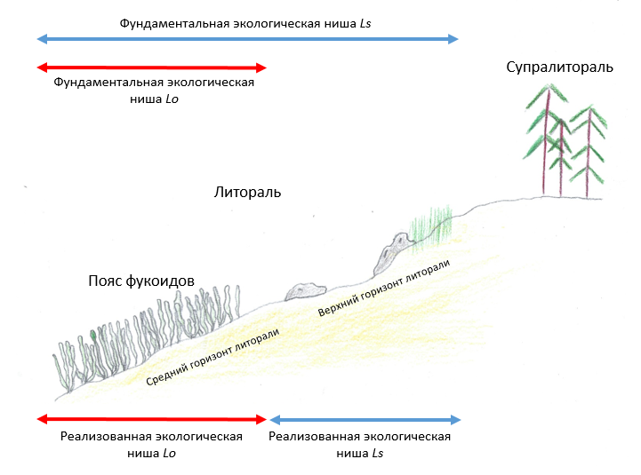

```{r setup, include=FALSE}
library(knitr)
opts_chunk$set(echo = FALSE, warning = FALSE, message = FALSE)
options(knitr.kable.NA = '')
```

```{r packages}
library(readxl)
library(ggplot2)
library(dplyr)
library(broom)
library(broom.mixed)
library(clipr)
library(bibtex)
library(reshape2)
library(mgcv)
library(gratia)
library(lme4)
library(performance)
library(cowplot)
library(ggsignif)
library(multcomp)
library(tidyverse)
```

```{r}
theme_set(theme_bw())
```


# Эколого-биологический центр “Крестовский остров”

# Лаборатория Экологии Морского Бентоса

# (гидробиологии)

&nbsp;

&nbsp;

```{r, out.width = '100%', fig.align = 'center'}
knitr::include_graphics("Figures/Logotype.jpg")
```

&nbsp;

# А. Бритиков

#  Какое разделение экологических ниш *Littorina saxatilis* (Olivi, 1792) и *Littorina obtusata* (Linnaeus, 1758) мы наблюдаем на литорали Белого моря?

&nbsp; 

&nbsp; 

&nbsp;

# Санкт-Петербург    
# 2024

\newpage

###### В работе анализировались разделение экологических ниш *Littorina saxatilis* и *Littorina obtusata* на литорали Белого моря. Были поставлены следующие вопросы: 1. Каково вертикальное распределение двух видов моллюсков на каменистой литорали о. Ряжков. 2. Как меняется интенсивность питания двух видов в разных условиях.  Было показано, что *L. obtusata* в основном обитает на нижних уровнях литорали в зарослях фукоидов, а *L.saxatilis* - на верхних горизонтах литорали. При этом питание *L. obtusata*  на фукоидах было активнее, чем на камнях, собранных выше по литорали. Это указывает на то, что приуроченность  *L. obtusata* к фукоидам отражает их фундаментальную экологическую нишу. Другой вид, *L. saxatilis*, распространённый в основном на верхнем уровне литорали. Однако при этом интенсивность питания этого вида оказывается  одинаковой как на фукоидах, так и на субстратах, собранных с более высоких уровней литорали. Это позволяет трактовать характер вертикального распределения *L. saxatilis*, как результат вытеснения вида на верхнюю часть литорали более сильным конкурентом, обитающим в поясе фукоидов.  

# Введение

  Экологическая ниша - это многомерное пространство, формируемое условиями и ресурсами, которые обеспечивают существование видов. Весь многомерный объем, который определяет условия окружающей среды, при которых вид может выживать и размножаться называется *фундаментальной*, или физиологической нишей. Многомерный объем, который данный вид занимает в действительности, измененный в результате взаимодействия с другими видами, называется *реализованной* нишей [@smith2012elements, @hutchinson1957concluding].   Понимание, как похожие между собой виды разделяют свои экологические ниши, имеет решающее значение для понимания эволюционных процессов, приспособляемости видов к разнообразным условиям среды и механизмов, определяющих биоразнообразие. Это позволяет разрабатывать стратегии сохранения и прогнозировать реакцию на изменения окружающей среды в экосистемах [@cooper2024ecological].

  Параметры реализованной ниши зависят от степени выраженности конкурентных отношений между сосуществующими видами [@costa2019competition]. Особенно сильно конкурентные отношения выражены при взаимодействии двух видов с очень похожими фундаментальными нишами [@guo2012separation; @maltseva2021linking; @hilgers2022evolutionary].

  На литорали Белого моря сосуществуют несколько близких видов семейства *Littorinidae* [@WoRMS20250114]. При этом самыми массовыми формами оказываются *L.saxatilis* (далее *Ls*) и *L.obtusata* (далее *Lo*). Являясь одними из наиболее распространенных моллюсков литорали, эти два вида играют важную роль в морских экосистемах. Они являются важным пищевым объектом  для многих видов [@ingolfsson2009predators; @ekendahl1998colour] и через их популяции проходит распространение  многих видов паразитов, для которых литторины являются промежуточными хозяевами [@granovitch2000spatial].  
  
  Так как эти два вида моллюска являются близкими, то они вынуждены разделять свои  экологические ниши. Знание закономерностей, лежащих в основе разделения экологических ниш *Ls* и *Lo*, очень важно, поскольку это позволило бы показать, как экологическая диверсификация смягчает межвидовую конкуренцию и способствует эффективной эксплуатации ресурсов [@maltseva2021linking]. Вместе с тем, экологические оси, по которым происходит разделение ниш, до сих пор остаются неизвестными. Один из наиболее ярких паттернов, говорящих о разделении ниш, проявляется в вертикальном распределении видов: считается, что *Lo* живет на более низких уровнях литорали, а *Ls* - на более высоких [@наумов1981зоологические]. Однако, что лежит в основе такой вертикальной сегрегации пока неизвестно. 
  
  Целью данной работы было оценить механизмы, лежащие в основе расхождения ниш *Ls* и *Lo*. В рамках поставленной цели мы попытались решить следующие задачи.
1. Описать вертикальное распределение двух видов на каменистой литорали о. Ряжков. 
2. Оценить интенсивность питания двух видов в разных условиях.

# Материалы и методика

## Место сбора

  Работа проводилась на территории Кандалакшского заповедника на острове Ряжков. Непосредственный сбор материалов происходил на илисто-песчаной литорали Южной губы (координаты точки сбора 67°00'27.2"N 32°34'34.4"E) и на литорали Фукусовой губы около скальных выходов (координаты точки сбора 67°00'27.6"N 32°35'07.5"E) (рис. 1).
  
{width="80%"} 

## Анализ вертикального распределения видов

  В этом эксперименте подсчитывали число моллюсков на разных уровнях литорали. Это нужно, чтобы оценить соотношение *Lo* и *Ls* на разных уровнях литорали.

  По малой воде мы заложили две трансекты - колышки, расположенные в одну линию через определенное расстояние. Одну - на литорали Южной губы, трансекта 1, другую на литорали Фукусовой губы у скальных выступов, трансекта 2 (рис. 1). Первая трансекта была поделена на 12 уровней. Первый уровень был отмечен колышком, находящимся на высоте 145,9 см над нулем глубин. Для определения точки, соответствующей нулю глубин мы, используя таблицу приливов для дня взятия проб определяли высоту воды при минимальном отливе. Зная эту высоту, мы заходили в воду при полном отливе на глубину равную высоте воды в таблице. Эта позиция рассматривалась как стандартная точка отсчета. Все последующие колышки находились на расстоянии 5 метров друг от друга. Вторая трансекта была поделена на 9 уровней. Первый колышек второй трансекты находился на высоте 72,3 см над нулем глубин. Промежуток между колышками составлял 10 метров, кроме трех последних, расстояние между которыми было 5 метров.
  
  Для оценки высоты уровней трансект над нулем глубин был использован водяной уровень, работающий на принципе сообщающихся сосудов. Стометровая, силиконовая, прозрачная трубка привязывалась к размеченной рейке высотой около 1.5 метров. Через воронку, закрепленную на конце, мы наливали в трубку воду. Второй конец трубки мы подносили к уровню трансекты и ждали, пока из этого конца переставала течь вода. После этого мы измеряли высоту, на которой находилась вода на нижнем уровне трансекты (рис. 2).

```{r, fig.cap="Рисунок 2. Принцип работы водяного уровня", out.width = '80%', fig.align = 'center'}

```

  На каждом уровне трансекты 1 было взято по три пробы, а на каждом уровне трансекты 2 - по пять проб. Пробы были взяты с помощью рамки  1/40 м^2^, которая случайным образом помещалась в окрестностях колышка, маркирующего уровень литорали. Из каждой рамки мы выбирали всех улиток. Виды улиток мы различали по форме раковин и характеру исчерченности периостракума. Моллюсков после определения подсчитывали. 
  
## Оценка количества фекалий, выделяемых в естественных условиях
  
  Чтобы проверить возможную причину разделения, связанную с разницей пищевых объектов мы собирали представителей двух видов моллюсков с различных субстратов: с фукоидов и с камней. Несмотря на интенсивные поиски, мы не смогли найти  на камнях вне пояса фукоидов ни одной особи *Lo*, имеющих размеры близкие к размерам *Ls*, использованных в этом эксперименте. Хотя *Ls* были собраны как с камней, так и с фукоидов. 
  
  Таких моллюсков мы транспортировали в лабораторию, где мы их определяли до вида и помещали по одному в ячейку сорока-пяти луночного планшета с морской водой без взвеси. После мы закрывали планшеты, привязывали к ним утяжелитель и оставляли на литорали на одни сутки. У собранных нами после этого моллюсков мы измеряли размер устья, а также количество выделившихся фекалий (пеллет) (рис.3).

```{r, fig.cap="Рисунок 3. Внешний вид пеллет (*Littorina saxatilis*)", out.width = '80%', fig.align = 'center'}
knitr::include_graphics("Figures/Snail&Pels.png")
```

## Экспериментальное изучение влияния типа субстрата на выделение пеллет
  
  Данный эксперимент был организован для того, чтобы проверить, влияет ли тип субстрата, на котором происходит питание улиток разных видов, на активность выделения пеллет. Улитки *Lo* были собраны с фукоидов, а *Ls* - с поверхности камней. Отобранных  моллюсков мы помещали в контейнеры с водой накрытые сеткой на 24 часа. По прошлым исследованиям, мы знаем, что улитки рода *Littorina* отчищают свой кишечник за одни сутки [@бритиковэколого]. Так мы получали улиток с пустыми кишечниками. Далее этих животных мы помещали в садки содержащие либо камни, либо фукоиды. Камни мы собрали с литорали (отбирали только те камни, на которых в естественных условиях были отмечены улитки). 
  
  Фукоиды двух видов *Fucus vesiculosus* и *Ascophyllum nodosum* были собраны в тех же местах, где были собраны улитки. Водоросли были очищены от эпибионтов и прочих организмов. Талломы водорослей (без разделения на виды) были помещены в садки, куда затем добавляли по 7-8 голодных особей каждого вида. Далее садки были закрыты сетью с размером ячеи 4 мм и к ним были привязаны грузы. Вся конструкция располагалась на литорали на одни сутки. Всего было проведено 3 повторности, в каждой из которых было установлено 3 садка с камнями и 3 садка с фукоидами. Спустя 24 часа мы извлекали садки, из которых вынимали моллюсков. Каждая особь далее была помещена индивидуально в ячейки сорока-пяти луночного планшета. Планшеты мы помещали в приливно отливную зону на сутки. После периода экспозиции в каждой ячейке мы подсчитывали число выделившихся фекалий.
  
## Статистическая обработка

  Все расчеты проводились с использованием функций языка статистического программирования R 4.4.2 [@R]. В качестве порогового значения отвержения нулевой гипотезы использовался уровень значимости $\alpha$=0,05.
  
  В качестве зависимой переменной при анализе вертикального распределения видов мы использовали логарифм численности моллюсков в данной пробе. В качестве предиктора использовалось значение высоты над нулем глубин. Поскольку, визуально, вертикальное распределение видов носило нелинейный характер для построения модели была выбрана техника аддитивных обобщенных моделей (GAM). Подбор параметров модели осуществляли с помощью пакета mgcv (@mgcv2017). 
  
Для описания выделения пеллет моллюсками, собранными в естественных условиях мы проанализировали бокс-плоты, отражающие связь количества выделенных пеллет с типом субстрата, с которого были собраны моллюски. Мы не проводили в данном случае строгих статистически сравнений, так как нам не удалось найти ни одной особи *Lo* на камнях выше пояса фукоидов в естественных биотопах (моллюски данного вида были отмечены только на поверхности песка или отдельных ветках фукоидов). 

  В качестве зависимой переменной в статистическом анализе материала экспериментов по  изучению влияния типа субстрата на выделение пеллет мы использовали количество пеллет. В качестве предикторов мы использовали тип субстрата и вид  моллюска. Поскольку эксперимент повторялся многократно, в качестве случайного фактора был взят номер повторности. После построения модели мы проводили попарное сравнение средних с помощью критерия Тьюки. 

```{r}
pel <- read_excel("Tables/Pelets_2024.xlsx")

lit <- read_excel("Tables/Pelets_2024.xlsx", sheet = "ОБилие литторин на уровнях")

lit_long <-
melt(data = lit, id.vars = c("Date", "Description", "Site", "Sampling_Level", "Real_H", "Sample"), variable.name = "Species", value.name = "N")

Mod <- gam(log(N+1) ~ s(Real_H, bs = "cr", by = Species, k = 7) + Species, data = lit_long)

pel %>%  
  filter(Type == "Caged") -> pel_caged

pel %>%  
  filter(Type == "Wild") -> pel_wild

pel_wild %>%  
  filter(Species == "Sax") -> pel_wild_Sax

pel_wild %>%  
  filter(Species == "Obt") -> pel_wild_Obt

#min(pel_wild_Obt$Pell)
#max(pel_wild_Obt$Pell)
#sd(pel_wild_Obt$Pell)

#min(pel_wild_Sax$Pell)
#max(pel_wild_Sax$Pell)
#sd(pel_wild_Sax$Pell)

lit$Site <- factor(lit$Site)

pel_caged$Experiment <- factor(pel_caged$Experiment)
pel_caged$Species <- factor(pel_caged$Species)
pel_caged$Substrate <- factor(pel_caged$Substrate)

Mod_pel <- lme(log(Pell+1) ~ Species * Substrate, random =  ~ 1|Experiment,  data = pel_caged)

pel_caged$Interact <- interaction(pel_caged$Species, pel_caged$Substrate)

Mod_interact <- lme(log(Pell+1) ~ -1 + Interact, random = ~ 1|Experiment,  data = pel_caged)

tukey_compar <- summary(glht(Mod_interact,linfct =  mcp(Interact = "Tukey")))

My_data <- expand.grid(Species = unique(pel_caged$Species), Substrate = unique(pel_caged$Substrate))

predicted <- predict(Mod_pel, newdata = My_data, level = 0)

X <- model.matrix(~ Species * Substrate, data = My_data)
  
SE <- sqrt(diag(X %*% vcov(Mod_pel) %*% t(X)))
  
My_data$Fit <- exp(predicted) - 1

My_data$Lwr <- exp(predicted - 1.96*SE) - 1

My_data$Upr <- exp(predicted + 1.96*SE) - 1
```  
  
# Результаты

## Анализ вертикального распределения видов

  Модель, описывающая вертикальное распределение видов по литорали (Табл. 1), выявила статистически значимую зависимость обилия обоих видов от высоты горизонта. 
  
```{r}
kable(tidy(Mod) [-3],
      caption = "Таблица 1. Параметры модели, описывающей вертикальное распределение видов улиток", 
      digits = c(NA, 2, 1, 4),
      col.names = c("Член модели", "edf", "F-критерий", "p-value"))
```
  
  Рисунок 4 показывает изменение количества моллюсков двух видов в зависимости от высоты над нулем глубин, предсказанное описанной выше моделью.  Видно, что обилие *Ls* в пределах пояса фукоидов было невелико. Вне пояса фукоидов обилие этого вида резко возрастало, и, с повышением высоты, оно незначительно увеличивалось.  Обилие *Lo* было максимальным в пределах пояса фукоидов достигая своего максимума приблизительно на высоте 125 см над уровнем нуля глубин. После пояса фукоидов обилие этого вида резко падает, после чего, с увеличением высоты, значимых изменений не наблюдалось.  

```{r, fig.cap="Рисунок 4. Распределение двух видов литторин по литорали. (A) *L.saxatilis*,  (B) *L.obtusata*. Вертикальной линией на графиках обозначено приблизительное место окончания пояса фукоидов. Серая зона вокруг линии регрессии отражает 95% доверительный интервал.", fig.width=9 }
Pl_Ls <-
draw(Mod, residuals = T, select = 1) +
  geom_vline(xintercept = 189,4) +
  theme_bw() +
  labs(x = "Высота над нулем глубин (см)", y = "Колличество L.saxatilis (логорифм)") +
  ggtitle("L.saxatilis", subtitle = "")

Pl_Lo <-
draw(Mod, residuals = T, select = 2) +
  geom_vline(xintercept = 189,4) +
  theme_bw() +
  labs(x = "Высота над нулем глубин (см)", y = "Колличество L.obtusata (логорифм)")+
  ggtitle("L.obtusata", subtitle = "")

plot_grid(Pl_Ls, Pl_Lo, labels = "AUTO")
```
  
## Оценка количества фекалий, выделяемых в естественных условиях

  Чтобы оценить интенсивность выделения фекалий в естественных условиях мы брали *Ls* и *Lo* из условий, являвшихся для данного вида естественными. На фукоидах мы собирали *Lo*, а на камнях - *Ls*. В среднем *Lo* в сутки выделяли 31 пеллет (минимальное значение выделившихся пеллет равно 4, максимальное - 79, sd = 16.1). *Ls* за сутки выделяли 11.8 пеллет (минимальное значение выделившихся пеллет равно 0, максимальное - 71, sd = 14.9).

## Экспериментальное изучение влияния типа субстрата на выделение пеллет

  Для представления первичных данных проведенного эксперимента мы построили бокс-плоты, отражающие связь количества пеллет с видом моллюска и субстратом, на котором он питался. *Lo*, которые питались на фукоидах, выделяли заметно больше пеллет, чем *Lo* питавшиеся на камнях. *Ls*, которые кормились на фукоидах, в среднем, выделяли меньше пеллет, чем *Ls*, которые кормились на камнях (рис. 5).

```{r, fig.cap="Рисунок 5. Зависимость количества пеллет у двух видов моллюсков от типа субстрата в экспериментальных условиях (первичные данные). Горизонтальные линии отражают среднее количество пеллет, выделяемых *Lo* (сплошная линия) и *Ls* (пунктирная линия)  в естественных условиях в  пределах того биотопа, где наблюдается максимальное обилие.", fig.width=9}

pel %>%  
  filter(Type == "Wild") %>%
  filter( !(Substrate == "Fucales" & Species == "Sax")) %>% 
  group_by(Substrate, Species) %>% 
  summarize(Mean_Pell = mean(Pell)) -> mean_pell

pel %>%  
  filter(Type == "Caged") %>%
  mutate(Species = recode(Species, "Obt" = "L.obtusata", "Sax" = "L.saxatilis")) %>% 
  ggplot(aes(x = Substrate, y = Pell, fill = Species)) +
  geom_boxplot() + 
  labs(x = "Субстрат", color = "Вид", y = "Колличество пеллет") +
  geom_hline(data = mean_pell, aes(yintercept = Mean_Pell, linetype = Species), size = 1) +
  scale_fill_manual(values = c("red", "blue")) +
  scale_color_manual(values = c("red", "blue")) +
  guides(color = "none", linetype = "none")
```

Для более строгого сравнения мы построили статистическую модель, описывающую связь количества выделенных пеллет с типом субстрата, на котором кормились улитки и видом моллюска (Табл. 2). Эта модель выявила статистически значимое влияние предикторов и их взаимодействия. 
 
```{r}
x <- tidy(Mod_pel)%>% mutate(estimate = estimate %>% round(2))%>% mutate(std.error = std.error %>% round(3))%>% mutate(statistic = statistic %>% round(3))%>% mutate(p.value = p.value %>% round(4))

kable(x, caption = "Таблица 2. Параметры модели, описывающей влияния типа субстрата на интенсивность выделение пеллет",
col.names = c("Тип эффекта", "случайны фактор", "Член модели", "Оценка парамтера", "Стандартная ошибка", "Число степеней свободы", "t-статистика",  "p-value"))
```

Согласно предсказаниям построенной модели (Рис. 6), статистически значимо отличается от всех остальных средних среднее количество пеллет, выделенных *Lo*, которые питались на фукоидах. 

```{r, fig.cap="Рисунок 6. Предсказания модели, описывающей зависимость количества пеллет у двух видов моллюсков от типа субстрата в экспериментальных условиях. Горизонтальные линии с приведенными над ними уровнями значимости маркируют статистически значимые различия.", fig.width=9}

My_data %>% 
  mutate(Species = recode(Species, "Obt" = "L.obtusata", "Sax" = "L.saxatilis")) %>% 
ggplot(aes(x = Substrate, y = Fit, fill = Species)) +
  geom_col(position = position_dodge()) +
  geom_signif(y_position = c(21, 21), xmin = 0.75, xmax = 1.25, annotations = "p<0.001", tip_length = 0) +
  geom_signif(y_position = c(23, 23), xmin = 0.75, xmax = 1.75, annotations = "p = 0.003", tip_length = 0) +
  geom_signif(y_position = c(25, 25), xmin = 0.75, xmax = 2.25, annotations = "p = 0.004", tip_length = 0) +
  labs(x = "Субстрат", fill = "Вид", y = "Колличество пелет") +
  scale_fill_manual(values = c("red", "blue"))
```

&nbsp;

# Обсуждение

  Полученные нами результаты показывают, что количество *Lo* достигает своего пика в пределах пояса фукоидов. Выше него обилие этого вида резко снижается. Обилие  *Ls* в пределах пояса фукоидов невелико, но оно резко увеличивается, если двигаться вверх по каменистой литорали. Эти данные хорошо соотносятся с данными, приведенными в  литературе [@наумов1981зоологические], где описана аналогичная вертикальная сегрегация. Расхождение видов вдоль градиента высоты можно объяснить двумя способами. Во-первых, это разделение может отражать различия в фундаментальных нишах двух видов. Если это так, то должны существовать какие-то физиологические особенности, которые не позволяют *Lo* подниматься выше пояса фукоидов, а *Ls*, наоборот спускаться вниз по литорали. Во-вторых, этот паттерн может отражать расхождение реализованных ниш, происходящее вследствие  конкуренции, которую выигрывает один из видов, более приспособленный к верхней (*Ls*) или нижней (*Lo*) части литорали. 
  
  Для выбора между указанными вариантами необходимо оценить проявление каких-либо физиологических параметров в разных участках градиента высоты. Одним из возможных показателей может являться интенсивность питания, которую мы можем оценить по количеству выделяемых пеллет - фекалий.   
  
  Согласно полученным нами результатам, интенсивность питания  *Lo*, питавшихся на поверхности камней, была существенно ниже, чем на фукоидах. Поскольку обилие  *Lo* выше на фукоидах и здесь же наблюдается более интенсивное питание, этот биотоп можно считать естественным местообитанием данного вида. Этот результат совпадает с литературными данными, где *Lo* рассматривается как растительноядные формы [@наумов1993вечно]. Обилие этого вида часто коррелирует с обилием макрофитов [@sergievsky1997long]. 

Количество пеллет, выделенных *Ls* при питании на фукоидах и на камнях, значимо не отличалось. Это может означать, что интенсивность питания этого вида не зависит от типа субстрата. Это позволяет считать, что *Ls* не зависит кардинально от типа биотопа. Считается, что *Ls* питается микрообрастателями камней [@наумов1993вечно], возможно, также, такие микрообрастатели представлены и на поверхности фукоидов. То есть, *Ls* может успешно питаться и на камнях, и на поверхности фукоидов.  

Таким образом, два вида литторин различаются по своей пищевой специализации, что вероятно коррелирует с организацией ротового аппарата двух видов [@watson1987habitat; @rolan1996differentiation].   *Lo* можно рассматривать, как более выраженного специалиста, питающегося, преимущественно, среди водорослей. *Ls* предстает более выраженным генералистом. Именно это может заставлять держаться *Lo* в пределах пояса фукоидов, а *Ls* - выше. 

Подобная пищевая специализация может быть, как результатом особенностей метаболизма вида [@maltseva2021linking], так и различия в строении ротовых аппаратов - радул [@watson1987habitat; @rolan1996differentiation]. Кроме того, показано, что во время отлива два вида ведут себя по-разному. *Lo* сохраняют свою активность, в то время как *Ls* закрывают устье крышечкой и становятся неподвижными [@mcmahon1990thermal]. Если принять указанные выше особенности видов, то можно предположить, что *Lo* наилучшим образом приспособлены к существованию в поясе фукоидов. *Ls* могут существовать как среди фукоидов, так и выше их пояса. В такой ситуации можно ожидать, что более специализированный вид (*Lo*) может вытеснить менее специализированный вид (*Ls*) из пояса фукоидов. 

Полученная гипотетическая схема соответствует следующему механизму формирования вертикального распределения видов литторин. Фундаментальные  ниши *Lo* и *Ls* пересекаются, но у последнего вида она более широкая. В поясе фукоидов происходит конкурентное вытеснение *Ls*. Этот вид  угнетен в поясе фукоидов, но процветает выше, куда не заходит *Lo*, не способная к питанию на камнях.   

&nbsp;

&nbsp;

&nbsp;

&nbsp;

&nbsp;

# Заключение

  На литорали Белого моря о. Ряжков мы видим разделение фундаментальной экологической ниши *L.saxatilis*, лежащую от нижней границы литорали до верхней границы, на реализованную, лежащей от верха пояса фукоидов до верхнего горизонта литорали. *L.obtusata* реализует свою фундаментальную экологическую нишу, лежащую в пределах пояса фукоидов, полностью. Описанную схему иллюстрирует рисунок 7.
  
```{r, fig.cap="Рисунок 7. Распределение фундаментальных и реализованных экологических ниш между *Lo* и *Ls*.", out.width = '80%', fig.align = 'center'}



```

# Благодарности
  
  Я хотел бы поблагодарить участников Беломорской экспедиции за помощь в подготовке и постановке полевого эксперимента, сотрудников Кандалакшского Государственного Природного заповедника за предоставление возможности сбора материала для написания данной исследовательской работы и моего научного руководителя Вадима Михайловича Хайтова, без участия которого не был бы поставлен эксперимент и написана данная работа.

# Список литературы
