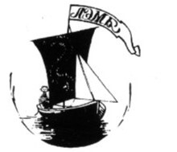
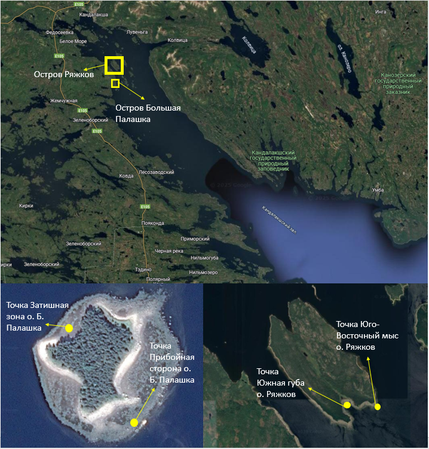
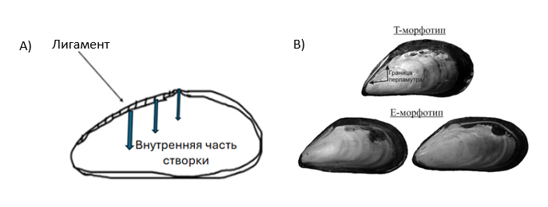

---
output:
  word_document:
    reference_docx: style_for_RMD.docx
bibliography: bibliography.bib
csl: meps.csl
---

```{r setup, include=FALSE}
library(knitr)
opts_chunk$set(echo = FALSE, message = FALSE, warning = FALSE)
```

```{r}
library(ggplot2)
```

```{r}
theme_set(theme_bw())
```


# Эколого-биологический центр “Крестовский остров”

# Лаборатория Экологии Морского Бентоса

# (гидробиологии)

 



 

# С. Беляева

# Сила прикрепления Mytilus trossulus и Mytilus edulis, поселяющихся на Ascophyllum nodosum и Fucus vesiculosus на литорали Белого моря

 

# Санкт-Петербург

# 2024

\newpage

###### У *Mytilus Sp*., которые живут на фукоидах есть много плюсов, например, защита. Однако *Fucus vesiculosus* не нравится это, и он всячески пытается избавится от паразита, данный фукоид начал выделять метаболиты, благодаря которым мидии морфатипа-E и морфатипа-T начали избегать прикрепления ближе к концу фукуса, так как чем выше развилка, тем она моложе, а чем развилка моложе, тем сильнее она выделяет метаболиты. Однако *Ascophyllum nodosum* никак не реагирует на прикрепление на него мидий. Было проведено измерение силы прикрепление, по которому построили графики, благодаря которым видна значимое различие силы прикрепления мидий на конце таллома растения и ближе к основанию водоросли.

# Введение

Среди разнообразных симфизиологических связей [@beklem1970] прямые топические взаимодействия играют самую важную роль. Эти взаимоотношения заключаются в том, что один из организмов положительно влияет на жизнь другого. Часто бывает, что тело организма одного вида предоставляет субстрат для прикрепления организмов другого вида. Например, к числу таких взаимодействий относятся формирование обрастатаний створок моллюсков [@varigin2018biotic] Такие формы сосуществования организмов разных видов обозначаются как *седвазиозы* [@Naumov_Fedyakov]. В таких системах поверхность тела морских животных или растений заселяется сидячими организмами-обрастателями, или консортами, которые не демонстрируют глубокой специализации к своему организму-субстрату (эдификатору консорции).  Так, например, на мелководьях морские желуди из рода *Balanus* часто связаны с раковинами мидий, но также могут обитать и на поверхности камней [@Naumov_Fedyakov].

Среди морских седвазиозов особое место занимают поселения мидий на литоральных макрофитах. Многочисленные исследования показали, что макрофиты не являются пассивным субстратом в этой системе, но активно воздействуют на своих консортов. Для мидий эти топические связи крайне выгодны так как водоросли предоставляют им дополнительный субстрат, что может приводить к снижению внутривидовой конкуренции моллюсков (Федорова, 2024), водоросли обеспечивают амортизацию при волновом воздействии [@katolikova2016genetic], а также позволяют снизить вероятность атак со стороны хищников [@khaitov2021species]. 

Если рассматривать влияние мидий на фукоиды, то для водорослей присутстиве консортов может носить отрицательный характер: обрастание мидиями снижает плавучесть талломов водорослей.  Недавно было показано, что литоральные *F.vesiculosus* выделяют в воду некоторые метаболиты, которые способны практически полностью блокировать прикрепление мидий к субстрату [@ershova2024]. Второй вид беломорских фукоидов (*A.nodosum*) не оказывает такого воздействия на моллюсков [@ershova2024].  Это входит в некоторое противоречие с наблюдаемыми в природе закономерностями распределения мидий. Так было показано, что обилие мидий на двух видах упомянутых водорослей не отличается: оба вида беломорских мидий, как *Mytilus edulis*, так и *M.trossulus*, демонстрируют практически равные плотности поселения как на *F.vesiculosus*, так и на *A.nodosum* [@Fedorova_2024, @Stolbovay_2005]. То есть отрицательного влияния со стороны *F.vesiculosus* увидеть не удается. Однако известно, что фукоиды – это многолетние организмы [@Kuznetsov1960]. Продолжительность их жизни может достигать 12 лет. Рост фукоидов сопровождается образованием развилок: каждый год формируется новая дихотомия [@Kuznetsov1960]. Многолетний таллом, таким образом, представляется гетерогенным микробиотопом, в котором разные участки характеризуются разным возрастом.  В связи с этим можно предположить, что более молодые участки фукоида выделяют описанные метаболиты, а старые участки фукуса их не секретируют или их выделение ослаблено.

Целью данной работы было оценить, насколько сила прикрепления *Mytilus edulis* и *Mytilus trossulus* зависит от возрастных характеристик фукоидов, к которым они прикрепляются. В рамках данной цели была поставлена задача выяснить влияет ли место расположения мидий на фукоиде на силу прикрепление моллюсков.


```{r}
library(readxl)
library(dplyr)
library(ggplot2)


dinfet <- read_excel("Data/Din Fet 2024.xlsx")

```


# Материал и методика

## Сбор фукоидов с мидиями

Мидии были собраны в четырех точках, различающихся по степени открытости для волнового воздействия (Рис. 1). Первая точка располагалась в куту Южной губы о. Ряжков. Она находится в затишной зоне. Вторая – на Юго-Восточном мысу о. Ряжков. Эта точка находится на прибойной стороне острова. Третья – в затишной зоне о. Б. Палашка. Четвёртая – на прибойной стороне о. Б. Палашка. Выбор точек сбора материала был обусловлен присутствием мидий на *Ascophyllum nodosum* и *Fucus vesiculosus*.

В каждой точке мы отбирали по три пучка *A.nodosum* и три пучка *F.vesiculosus*. Водоросли срезали ножом в самом основании и каждый пучок помещали в отдельный пластиковый пакет, который транспортировали в лабораторию.



## Измерение силы прикрепления

Водоросли располагали в плоской кювете так, чтобы можно было подсчитать количество развилок, идущих от точки его крепления к грунту до того места, где были обнаружены мидии (Рис. 2, A). Эти развилки появляются на апикальной части слоевища каждый год и могут трактоваться, как маркеры возраста [@Kuznetsov1960]: чем выше развилка от основания фукуса, тем моложе эта часть фукоида. Для каждой, включенной в анализ, мидии мы определяли сколько развилок отделяет ее положение от точки крепления фукоида к субстрату.

Описанная выше работа производилась только с теми моллюсками, длина раковины которых превышала 10 мм. Далее к таким мидиям мы прикрепляли зажим-крокодильчик (Рис. 2, C), который присоединяли к динамометру Мегеон-23020, при помощи которого мы измеряли силу прикрепления моллюсков (Рис. 2, B).  Для этого мы постепенно увеличивали натяжение, фиксируя положение фукоида, до тех пор, пока не произойдет, отрыв моллюска от субстрата. Мы записывали максимальное значение усилия. Точность измерения силы составляла 0.001 Н.

Далее каждую особь взвешивали на электронных весах с точностью до 0.001 г. После измерений, особь была сварена и раковина очищена от мягких тканей. Затем каждую створку подписали индивидуальным номером. Всего было изучено 334 особи.


## Идентификация мидий по морфотипу

В данной работе мы разделили мидий на две группы, которые соответствуют двум морфотипам [@khaitov2021species].  Эти морфотипы определяются характером развития перламутрового слоя в районе лигамента (Рис. 3, A). У мидий T-морфотипа перламутровый слой в районе лигамента недоразвит и там прослеживается, полоска неприкрытого призматического слоя. У мидий E-морфотипа в этой зоне перламутровый слой полностью закрывает призматический слой.  Указанные морфотипы с высокой точностью соответствуют двум видам мидий *M.edulis* (мидии E-морфотипа) и *M.trossulus* (мидии T-морфотипа). В дальнейшем мы будем ассоциировать эти морфотипы с видами. 



## Статистическая обработка.

Мы провели регрессионный анализ, в котором зависимой переменной была сила прикрепления мидии (использовали логарифмированное значение, чтобы не нарушались условия применения регрессионного анализа). В качестве предикторов в модели использовали количество развилок от места прикрепления мидии до прикрепительного диска фукоида (далее эта переменна обозначается «Branch»), вид фукоида («F_Sp»), морфотип мидии («Morphotype») и все возможные взаимодействия между этими переменными. Кроме того, поскольку очевидно, что сила прикрепления может зависеть от размера мидии, мы в анализ включили в качестве ковариаты, также, вес мидии («Mussel_Weight»). Обработка и визуализация результатов производилась с помощью языка статистического программирования R [@RCoreTeam].

# Результаты и обсуждение

Мидии были обнаружены от 1 развилки, которая находилась в непосредственной близости от прикрепительного диска до развилки с номером 22. При этом чаще всего моллюски были отмечены на 3-5 развилках. Больше всего развилок мы наблюдали на талломах *A.nodosum* (Таблица 1).

```{r}
df <-
dinfet %>% 
  group_by(Branch,Morphotype,F_Sp) %>% 
  summarise(N = n())

library(reshape2)

table <- dcast(data = df,formula = Branch ~ Morphotype + F_Sp)


table[is.na(table)]<-0

kable(table, 
      col.names = c("Номер развилки", "*M.edulis* на *A.nodosum*","*M.edulis* на *F.vesiculosus*","*M.trossulus* на *A.nodosum*","*M.trossulus* на *F.vesiculosus*"), 
      caption = "Таблица 1. Количество особей разных видов мидий, отмеченных на разных развилках двух видов фукоидов.")


```

Регрессионный анализ показал, что наблюдаются статистически значимые связи силы прикрепления с изученными предикторами (Таблица 2). Можно заметить, что наблюдается значимая положительная связь силы прикрепления с весом мидии. То есть более крупные мидии прикрепляются сильнее.

Для поставленной в работе цели наиболее важным оказывается значимое взаимодействие вида фукоидов с номером ветвления. Это говорит о том, что характер связи силы прикрепления с номером ветвления оказывается разным для разных видов фукоидов. Для более детального анализа связей необходимо рассмотреть ход линий регрессии, которые предсказывает эта модель. 

```{r}
Mod <- lm(log(Force) ~ Branch * Morphotype * F_Sp + Mussel_Weight, data = dinfet)

```


```{r}
library(broom)

  sum_mod <- tidy(Mod)

sum_mod$signif <- c("***",".","***","***","***"," ","*"," "," ")


kable(sum_mod,
      col.names = c("Член модели","Оценка параметра","Стандартная ошибка","t-критерий","P value", ""),
      caption = "Таблица 2. Результаты регрессионного анализа связи между силой прикрепления с номером ветвления (Branch), морфотипом (Morphotype), видом фукоида (F_Sp) и весом (Mussel_Weight).", 
digits = c(NA,2,3,2,4,NA))
```

На рисунке ++ приведены линии регрессии, отражающие зависимость силы прикрепления мидий от номера развилки на фукоиде для двух групп мидий на разных видах фукоидов. 

Из данных, приведенных на этом рисунке, видно, что мидии, сидящие ближе к концу таллома (более высокий номер развилки) *F.vesiculosus* , прикрепляются слабее, а мидии, сидящие ближе к прикрепительному диску этого вида водоросли, прикрепляются сильнее. Такой характер связи демонстрируют как мидии E-морфотипа, так и мидии T-морфотипа. На другом виде фукоидов (*A.nodosum*) значимой связи силы прикрепления с номером ветвления не наблюдается ни для, E- ни для T-морфотипа. 


```{r,fig.cap="Рисунок 4. Линии регрессии, отражающие связь между силой прикрепления мидии и номером развилки, на которой сидит мидия, для разных видов фукоидов и разных морфотипов мидий. Для построения линий регрессии значения веса мидий были взяты, как средние значения."}

dinfet %>% 
  group_by(F_Sp, Morphotype) %>% 
  do(data.frame(Branch = seq(min(.$Branch), max(.$Branch), 1))) %>% 
  mutate(Mussel_Weight = mean(dinfet$Mussel_Weight)) -> My_data
  

predicted <- predict(Mod, newdata = My_data, se.fit = TRUE)

My_data$Fit <- predicted$fit
My_data$SE <- predicted$se.fit
My_data$Upr <- My_data$Fit + 1.96*My_data$SE 
My_data$Low <- My_data$Fit - 1.96*My_data$SE


ggplot(My_data, aes(x = Branch, y = Fit)) + 
  geom_ribbon(aes(ymin = Low, ymax = Upr, fill = F_Sp), alpha = 0.3) +
  geom_line(aes(color = F_Sp), size = 1) +
  facet_wrap(~Morphotype) +
  scale_color_manual(values = c("red", "blue") )+
  theme_bw() +
  geom_point(data = dinfet, aes(y = log(Force), color = F_Sp)) + 
  labs(x = "Номер развилки", y = "Логарифм силы прикрепления", color = "Вид фукоида")+
  guides(fill = "none")


```

Таким образом, проведенное нами исследование показало, что номер развилки влияет на силу прикрепления мидии, но только в случае талломов *Fucus vesiculosus*. Мидии, которые крепятся в более молодых участках талломов, возможно испытывают отрицательное воздействие со стороны фукусов. Это хорошо согласуется с обнаруженной Т.Ершовой (2023) закономерностью: метаболиты *F.vesiculosus* ингибируют прикрепление мидий.  Однако наши результаты позволяют ожидать, что в старой части таллома это воздействие ниже. Именно там и могут поселяться мидии. Что касается *Ascophyllum nodosum*, то на этом виде водорослей мидии располагаются по всей длине фукоида с одинаковой силой прикрепления. Именно такой паттерн и следовало бы ожидать, если *A.nodosum* не выделяет метаболитов, ингибирующих прикрепление мидий. 


# Благодарности
Хотелось бы выразить благодарность Вадиму Михайловичу Хайтову как научному руководителю, Кандалакшскому заповеднику за возможность работы и команде LIX Беломорской экспедиции за помощь разбора материала.

# Литература
