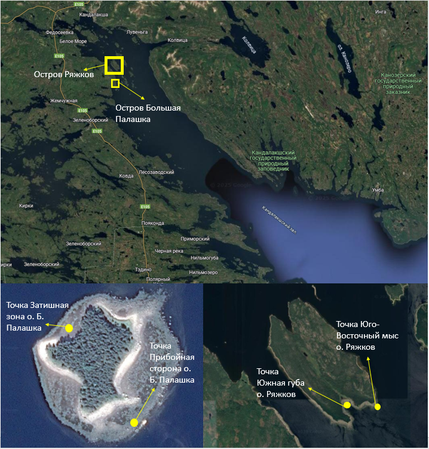

```{r setup, include=FALSE}
library(knitr)
opts_chunk$set(echo = FALSE, message = FALSE, warning = FALSE)
```

У *Mytilus*, которые живут на фукоидах есть много плюсов, например, защита. Однако Fucus vesiculosus не нравится это, и он всячески пытается избавится от паразита, данный фукоид начал выделять метаболиты, благодаря которым мидии морфатипа-E и морфатипа-T начали избегать прикрепления ближе к концу фукуса, так как чем выше развилка, тем она моложе, а чем развилка моложе, тем сильнее она выделяет метаболиты. Однако Ascophyllum nodosum никак не реагирует на прикрепление на него мидий. Было проведено измерение силы прикрепление, по которому построили графики, благодаря которым видна значимое различие силы прикрепления мидий на конце таллома растения и ближе к основанию водоросли.


# Введение

Среди разнообразных симфизиологических связей (Беклемишев 1970) прямые топические взаимодействия играют самую важную роль. Эти взаимоотношения заключаются в том, что один из организмов положительно влияет на жизнь другого. Часто бывает, что тело организма одного вида предоставляет субстрат для прикрепления организмов другого вида. Например, к числу таких взаимодействий относятся формирование обрастатаний створок моллюсков (Varigin 2018). Такие формы сосуществования организмов разных видов обозначаются как седвазиозы (Наумов, Федяков, 1993). В таких системах поверхность тела морских животных или растений заселяется сидячими организмами-обрастателями, или консортами, которые не демонстрируют глубокой специализации к своему организму-субстрату (эдификатору консорции).  Так, например, на мелководьях морские желуди из рода Balanus часто связаны с раковинами мидий, но также могут обитать и на поверхности камней (Наумов, Федяков, 1993).

Среди морских седвазиозов особое место занимают поселения мидий на литоральных макрофитах. Многочисленные исследования показали, что макрофиты не являются пассивным субстратом в этой системе, но активно воздействуют на своих консортов. Для мидий эти топические связи крайне выгодны так как водоросли предоставляют им дополнительный субстрат, что может приводить к снижению внутривидовой конкуренции моллюсков (Федорова, 2024), водоросли обеспечивают амортизацию при волновом воздействии (Katolikova et al., 2016), а также позволяют снизить вероятность атак со стороны хищников (Khaitov et al, 2021). 

Если рассматривать влияние мидий на фукоиды, то для водорослей присутстиве консортов может носить отрицательный характер: обрастание мидиями снижает плавучесть талломов водорослей.  Недавно было показано, что литоральные F.vesiculosus выделяют в воду некоторые метаболиты, которые способны практически полностью блокировать прикрепление мидий к субстрату (Ершова, 2023). Второй вид беломорских фукоидов (A.nodosum) не оказывает такого воздействия на моллюсков (Ершова, 2023).  Это входит в некоторое противоречие с наблюдаемыми в природе закономерностями распределения мидий. Так было показано, что обилие мидий на двух видах упомянутых водорослей не отличается: оба вида беломорских мидий, как Mytilus edulis, так и M.trossulus, демонстрируют практически равные плотности поселения как на F.vesiculosus, так и на A.nodosum (Федорова, 2024, Столбовая, 2005). То есть отрицательного влияния со стороны F.vesiculosus увидеть не удается. Однако известно, что фукоиды – это многолетние организмы (Кузнецов, 1960). Продолжительность их жизни может достигать 12 лет. Рост фукоидов сопровождается образованием развилок: каждый год формируется новая дихотомия (Кузнецов, 1960). Многолетний таллом, таким образом, представляется гетерогенным микробиотопом, в котором разные участки характеризуются разным возрастом.  В связи с этим можно предположить, что более молодые участки фукоида выделяют описанные метаболиты, а старые участки фукуса их не секретируют или их выделение ослаблено.

 Целью данной работы было оценить, насколько сила прикрепления Mytilus edulis и M. trossulus зависит от возрастных характеристик фукоидов, к которым они прикрепляются. В рамках данной цели была поставлена задача выяснить влияет ли место расположения мидий на фукоиде на силу прикрепление моллюсков.


```{r}
library(readxl)
library(dplyr)
library(ggplot2)


dinfet <- read_excel("Data/Din Fet 2024.xlsx")

```


Материал и методика

Сбор фукоидов с мидиями

Мидии были собраны в четырех точках, различающихся по степени открытости для волнового воздействия (Рис. 1). Первая точка располагалась в куту Южной губы о. Ряжков. Она находится в затишной зоне. Вторая – на Юго-Восточном мысу о. Ряжков. Эта точка находится на прибойной стороне острова. Третья – в затишной зоне о. Б. Палашка. Четвёртая – на прибойной стороне о. Б. Палашка. Выбор точек сбора материала был обусловлен присутствием мидий на Ascophyllum nodosum и Fucus vesiculosus.
В каждой точке мы отбирали по три пучка A.nodosum и три пучка F.vesiculosus. Водоросли срезали ножом в самом основании и каждый пучок помещали в отдельный пластиковый пакет, который транспортировали в лабораторию.


