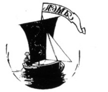

---
output:
  word_document:
    reference_docx: style_for_RMD.docx
bibliography: Ostrovsky_bibliography_2.bib
---

```{r setup, include=FALSE}
library(knitr)
opts_chunk$set(echo = FALSE, warning = FALSE, message = FALSE)
```


```{r Пакеты}
library(readxl)
library(vegan)
library(dplyr)
library(ggplot2)
library(patchwork)
library(reshape2)
library(cowplot)
library(dendextend)
library(ggmap)
Crang_2024 <- read_excel("Data/Crang_2024.xlsx", na = "NA", sheet = "Full")
```


# Эколого-биологический центр “Крестовский остров”

# Лаборатория Экологии Морского Бентоса

# (гидробиологии)

 

 



 

# В. Островский

# Креветки *Crangon crangon* (Linnaeus, 1758) специалисты или генералисты на литоральных пляжах Белого моря?

 

 

# Санкт-Петербург

# 2024

\newpage


###### В ходе работы была изучена связь между структурой бентосных сообществ и рациоом креветок *C.crangon* в пределах двух практически изолированных друг от друга илисто-песчаных пляжей: Южной и Северной губах о.Ряжкова. Высокого сходства между структурой бентосного сообщества и характеристиками рациона креветок не наблюдается. Показано, что разнообразие диеты отрицательно коррелирует с разнообразием сообществ.В менее разнообразных сообществах креветки проявляют черты генералиста, а в более разнообразных сообществах они переходят к более специализированному питанию.


# Ведение 

Пищевое поведение хищников-универсалов и специализированных хищников определяется различными трофическими адаптациями. Хищники-универсалы — это такие хищники, которые способны ловить любую добычу без определенного различия между ними [@pompozzi2022livestock]. Хищники специалисты выбирают более подходящую для себя по параметрам жертву [@pompozzi2022livestock]. В результате этого универсалы, они же генералисты, более адаптивные к внешним условиям среды нежели специалисты [@pompozzi2022livestock]. Если в результате каких-либо воздействий исчезнет добыча, которой питался специалист и он уже не сможет найти себя замену именно этому пищевому объекту, то хищник специалист, либо вынужден переместиться в новое местообитание либо погибнет. В результате численность популяционной группировки специалиста должна снижаться при условии снижения обилия жертвы. Так на примере сов специалистов (воробьиные совы) и сов генералистов  (мохноногие совы) было показано, что при недостатке пищевых объектов стратегия хищников-специалистов была менее успешной, нежели стратегия универсалов: нехватка основной пищи ограничивала производство потомства у хищников-специалистов, чья численность уменьшалась [@korpimaki2020difference].

На литорали арктических морей условия еще более суровые и популяции потенциальных жертв очень нестабильны [@descamps2017climate]. Вместе с тем, в этих сообществах обитают многочисленные хищники: приапулиды [@KamenivaSpb], брюхоногие моллюски [@Aristov2011], полихеты [@dikaeva2020distribution] и ракообразные [@negoescu1997anthurideans]. Вместе с тем, степень специализированности этих хищников оценена недостаточно. Так, например, хищные улитки Amauropsis islandica распространены на литоралях Белого моря. Так как здесь условия более суровые, значит они должны проявлять больше универсальный тип питания, нежели специальный. Однако как показывают многочисленные исследования питания Amauropsis islandica, этот вид является, скорее хищником-специалистом. Эти улитки и чаще всего в качестве своей жертвы использует один единственный вид – Macoma baltica [@ChistikovaEco], хотя в рационе этого хищника присутствуют и другие виды [@PyzichenkoEco]. 

Одним из самых обильных хищников на илисто-песчаных литоральных пляжах Белого моря является креветки *Crangon crangon* (Linnaeus, 1758). Этот вид часто встречается в бентосных сообществах многих морей Северного Полушария.  У него широкий ареал распространения вдоль европейского побережья от Белого моря до Марокко в пределах Атлантического океана, а также в Средиземном и Черном морях. [@luttikhuizen2008phylogeography]. В Белом море он также создает массовые поселения в Мезенском, Двинском, Кандалакшском и Онежских заливах [@Kyznicov1964].   

Эти ракообразные - активные хищники, которые для маскировки зарываются в песок так, что на поверхности остаются только глаза [@Naymov1981zoo]. Самое большое количество данных о рационе этого вида собрано у побережий Ирландского, Северного и Ваттова морей так как он там имеет промысловое значение [@Kyznicov1964].  Для Белого моря характерно питание относительно малоподвижными микро- и мейобентосными животными: харпактициды, спат и сеголетки двустворчатых моллюсков, мелкие нематоды и амфиподы (или их молодь), молодь гастропод и полихет или очень мелкие виды, а также трупы некоторых других мелких беспозвоночных (насекомые и клещи, смытые в воду с берега), голожаберные моллюски [@ByrycovskiyFeedeng]. Анализ спектра питания этого вида, выявил высокое разнообразие жертв. Это свидетельствует, скорее, о том, что данный вид является хищником-генералистом. 

Во всех работах, посвящённых питанию креветок *C. crangon*, за рамки обсуждения оставалось то, как связан рацион питания этого хищника со структурой сообщества, в котором он питается.   Известно, что сообщества литорали демонстрируют высокую пространственную вариабельность [@brind2005multiscale]. Так как хищник-генералист не связан с каким-то одним видом пищевых объектов, то можно ожидать, что при вариации структуры сообщества, в котором кормится хищник, будет наблюдаться и вариация диеты. То есть можно ожидать ковариацию структуры сообщества и рациона хищника. Если такой связи нет, то это будет противоречить стратегии хищника-генералиста. Целью данной работы стала проверка гипотезы о наличии такой корреляции. В рамках этой цели мы попытались решить следующие задачи.

1. Сравнить сообщества бентоса двух илисто-песчаных пляжей, относительно изолированных, но расположенных на небольшом расстоянии дуг от друга: в Южной и Северной губах острова Ряжкого (Кандалакшский залив Белого моря, территория Кандалакшского Государственного Природного Заповедника). 
2. Описать и сравнить характер питания C. crangon в этих двух акваториях. 
3. Выяснить существует ли корреляция между структурой бентосного сообщества и характеристиками рациона креветок. 

# Материалы и методика

## Полевые сборы 

Материалы, лежащие в основе данной работы, были собраны с 11.08.2023 по 12.08.2023 в ходе LVII Беломорской экспедиции Лаборатории Экологии Морского Бентоса (гидробиологии) в Южной губе острова Ряжкова и с 15.08.2024 по 18.08.2024 в Северной губе острова Ряжкова (Рис. 1).


```{r Карты}
# outline_S <- read_excel("Data/Crang_2024.xlsx", sheet = "Outline_s",  na = "NA")
# sampl_S <- read_excel("Data/Crang_2024.xlsx" , sheet = "Coordinates_s",  na = "NA")
#   
# Pl_map <-
#   ggplot(outline_S, aes(x = Lon, y = Lat)) + 
#   geom_path(aes(linetype = Type)) + 
#   guides(linetype = "none") + 
#   scale_linetype_manual(values = c(2,1, 3)) +
#   theme_minimal()
#     
# Pl_map_S <-
# Pl_map + geom_point(data = sampl_S) 
# 
# 
# outline_N <- read_excel("Data/Crang_2024.xlsx", sheet = "Outline",  na = "NA")
# sampl_N <- read_excel("Data/Crang_2024.xlsx" , sheet = "Coordinats",  na = "NA")
#   
# Pl_map <-
#   ggplot(outline_N, aes(x = Lon, y = Lat)) + 
#   geom_path(aes(linetype = Type)) + 
#   guides(linetype = "none") + 
#   scale_linetype_manual(values = c(2,1)) +
#   theme_minimal()
# 
# Pl_map_N <-
# Pl_map + geom_point(data = sampl_N) 

library(ggmap)

sampl_S <- read_excel("Data/Crang_2024.xlsx" , sheet = "Coordinates_s",  na = "NA")
sampl_N <- read_excel("Data/Crang_2024.xlsx" , sheet = "Coordinats",  na = "NA")


load("Data/Ryazh_map.RData")

lat_lim_s <- c( 67.003243 , 67.010861)

lon_lim_s <- c(32.557511, 32.587381)


Pl_Youzh <- 
ggmap(Ryazh_map) + 
  geom_point(data = sampl_S, aes(x = Lon, y = Lat), shape=21, fill="yellow", size = 2) + 
  coord_map(xlim = lon_lim_s, ylim = lat_lim_s ) +
  theme(axis.text = element_blank(), axis.title = element_blank(), axis.ticks = element_blank()) + ggtitle("Южная губа") 

 
lat_lim_n <- c( 67.023134 , 67.028567)
lon_lim_n <- c(32.528909, 32.546311)

Pl_Sev <-
ggmap(Ryazh_map) + 
  geom_point(data = sampl_N, aes(x = Lon, y = Lat), shape=21, fill="yellow", size = 2) + 
  coord_map(xlim = lon_lim_n, ylim = lat_lim_n ) +
  theme(axis.text = element_blank(), axis.title = element_blank(), axis.ticks = element_blank()) + ggtitle("Северная губа") 


Pl_Ryazh <-
ggmap(Ryazh_map) +
  geom_rect(aes(xmin = lon_lim_s[1], xmax = lon_lim_s[2], ymin = lat_lim_s[1] , ymax = lat_lim_s[2]), color = "yellow", fill = NA) +
  geom_rect(aes(xmin = lon_lim_n[1], xmax = lon_lim_n[2], ymin = lat_lim_n[1] , ymax = lat_lim_n[2]), color = "yellow", fill = NA) +
  annotate(x =  32.552681, y = 67.017926, geom = "text", label = "о. Ряжков", color = "white")  +
  theme(axis.text = element_blank(), axis.title = element_blank(), axis.ticks = element_blank())


```


```{r, fig.cap="Рисунок 1. Карта района сбора материала (А) о. Ряжков,  (B) Северная губа и (С) Южная губа. Точками обозначены участки, где были отловлены креветки. В тех же точках были взяты пробы бентоса. ", fig.width=10}

plot_grid(Pl_Ryazh, Pl_Sev, Pl_Youzh, nrow = 1, labels = "AUTO", scale = c(0.9, 1, 1.2))

```


Материал собирался во время отлива, но, когда еще большая часть литорали была покрыта водой. Пробы брали сачком с мелкой сеткой, имевший диаметр кольца около 30 см. Сачок ставили к урезу воды и человек, собирающий пробы, очень быстро отходил в глубь воды на 2-4 метра от уреза воды и вел сачок по дну поднимая ил с песком. Далее содержимое сачка промывали и из промытой пробы извлекали всех креветок. 

В каждой точке осуществлялось по три таких отлова в Южной губе и по пять в Северной. Все особи, пойманные в одной точке, сразу были помещены в емкость объемом 25 мл, без воды, что предотвращало переваривание пищи. Далее (не позднее одного часа) креветки были залиты 4% формалином.  Координаты точки отлова засекали с помощью GPS-навигатора. Всего были произведены сборы с 11 точек в Южной губе и 5 точек в Северной губе. Различие в количестве отловов определялось, во-первых, различием в плотности поселения креветок, а, во-вторых, размерами илисто-песчаных пляжей в этих акваториях.  

В тех же точках, где производили отлов креветок, но спустя, как минимум, сутки, производили отбор количественных проб для описания сообщества бентоса. Пробы собирались при помощи рамки площадью 55 см2, которую вдавливали в грунт на глубину около 10 см. Собранные пробы складывали в отдельный пакет с этикеткой. На каждой точке было взять по три пробы. Таким образом, бентос Южной губы был охарактеризован по 33 пробам, а бентос Северной губы – по 15 пробам. Все пробы были промыты при помощи сита с диаметром ячейки 0.5 мм. И промытый грунт фиксировался в баночку объёмом 30 мл с 10% формалином. 

## Анализ размерной структуры популяции

Каждая креветка была взвешена на электронных весах с точностью до 1 мг. Длина карапакса креветок была измерена с помощью электронного штангенциркуля с точностью до 0.01 мм. 

## Вскрытие 

Вскрытие каждой особи проводилась при помощи лезвия бритвы. Креветка бралась в руку и разрезалась по медиальной линии на две половинки. Далее под бинокуляром проводился осмотр желудка. В случае нахождения пищевого комка, его извлекали при помощи пинцета и перекладывали на предметное стекло с каплей глицерина. Содержимое желудка просматривалось под микроскопом при увеличении от 10х10 до 10х40. Для каждой особи мы отмечали только присутствие того или иного компонента питания. Всего в ходе работы было обработано 71 особь C.crangon из Северной губы и 135 особей из Южной губы. 


## Разборка грунта 

Грунтовые пробы просматривали в камере Богорова под бинокуляром. Всех представителей бентоса выбирали из грунта и фиксировали 25 мл емкости с 10% формалином. После разборки проб производили определение животных до минимально возможного таксономического уровня. Для каждого таксона было подсчитано количество особей. Далее данные были занесены в электронные таблицы.

## Статистическая обработка

Все статистические анализы были проведены с помощью языка статистического программирования R Studio version 2024. 12.0  [@simpson2022package].

В результате обработки данных были заполнены таблицы двух типов. Первый тип таблиц характеризовал питание креветок в каждой из изученных точек. Для этого каждый из пищевых объектов характеризовали его частотой, т.е. в какой доле креветок, отловленных в данной точке, был встречен данный компонент питания. Построение этой таблицы позволило вычислить две интегральные характеристики питания: (1) количество видов, отмеченных в желудках креветок в данной точке; (2) разнообразие рациона. Для последней оценки мы использовали индекс Шеннона, который вычисляли по следующей формуле: 


$$
H_{diet} = - \Sigma (P_i \times \log(P_i))
$$

Где за $P_i$ принята частота встречаемости i-го пищевого объекта.

Вторая таблица характеризовала обилие видов в пробах бентоса. Для каждого таксона в каждой точке мы вычислили среднее значение численности. Далее на основе этой таблицы для каждой точки был вычислен индекс Шеннона по следующей формуле:


$$
H_{community} = - \Sigma (\frac{N_i}{N_{total}} \times \log(\frac{N_i}{N_{total}}))
$$


Где $N_i$ - средняя плотность поселения i-го  вида в данной точке, $N_{total}$ - сумма всех обилий видов, отмеченных в данной точке. 


Для описания размерной структуры поселений креветок были построены частотные гистограммы, отражающие распределение размеров карапакса. Кроме того, были построены сеттер-диаграммы, отражающие связь размера и веса особей.


Для сравнения сообществ бентоса Южной и Северной губы была построена ординация описаний с помощью метода многомерного шкалирования на основе матрицы коэффициентов Брея-Куртиса. Для этого анализа применяли функции из пакета "vegan" [@oksanen2022vegan].

Для сопоставления сообщества бентоса и структуры рациона было проведено два типа анализов. Во-первых, мы оценили связь интегральных показателей рациона (количество видов корма и видовое разнообразие) с интегральной характеристикой сообщества (его видовым разнообразием). Для количественной оценки связи были вычислены коэффициенты корреляции. Во-вторых, мы провели сопоставление двух результатов анализа кластеризации точек, в которых были описаны сообщества бентоса и питание креветок. Для этого было построено две дендрограммы (применяли метод Варда, на основе матрицы коэффициентов Брея-Куртиса). Вычисление матриц коэффициентов Брея-Куртиса проводилось с помощью пакета “vegan” [@oksanen2022vegan]. Далее две дендрограммы сравнивали методом пермутационной подгонки тангл-граммы с помощью пакета “dendextend” [@galili2015dendextend].   


# Изложение и обсуждение результатов


## Сравнение бентосных сообществ в двух акваториях
На рисунке 2 приведены результаты ординации описаний сообществ.  На этом рисунке хорошо заметны два облака точек, которые соответствуют двум акваториям. Полученные данные говорят о том, что между сообществом Южной и Северной губы существуют некоторые различия.  Однако применение кластерного анализа (Рис. 3) позволило увидеть, что многообразие сообществ имеет более сложную природу. 

```{r, fig.cap="Рисунок 2 Ординация описаний сообществ Южной и Северной губы", fig.width=10}

community <- read_excel("Data/Crang_2024.xlsx", sheet = "Чистовые",  na = "NA")

community %>% 
  group_by(Area, Site) %>% 
  select(-ID) %>% 
  summarise_all(.funs = "mean") ->
  comm

ord_comm <- metaMDS(comm[,-c(1:2)], distance = "bray", trace = FALSE)

# plot(ord_comm, type = "t")

mds_points_comm <- data.frame(scores(ord_comm)$sites)

mds_points_comm$Area <-comm$Area

ggplot(mds_points_comm, aes(  NMDS1, NMDS2,t, color = Area)) +
  geom_point(size = 4)+
  theme_bw()+
  scale_color_manual(values = c("blue", "red"))+
labs(x = "MDS1", y = "MDS2", color = "Акватория")
```

На дендрограмме (Рис. 3) можно выделить 4 группы описаний, которые можно
трактовать, как четыре типа сообществ, представленных в двух акваториях. Первая группа (описания №№ 1,2,3,9), вторая (5,11,16,12,15), третья (4,13,10,6,14) и четвертая (7, 8). Так в первой большая часть сообщества из Северной губы это 1-3 класс и только одно сообщество из Южной - девятое. Во втором и третьем одно сообщество из Северной губы 5 и 4 соответственно, и остальное из Южной губы. Четвертое сообщество полностью состоит только из описаний, полученных из Южной губы. Полученные результаты позволяют говорить, что в пределах одной акватории бывает варьирование сообществ и один и тот же тип сообществ может наблюдаться в разных акваториях. 

```{r, fig.cap="Рисунок 3. Дендрограмма, отражающая сходство между описаниями бентосных сообществ в Северной (№№ 1-5) и Южной губе (№№ 6-16).", fig.width=10}

comm_dist <- (vegdist(comm[,-c(1:2)], method = "bray"))
dendr_comm <- as.dendrogram(hclust(d = comm_dist, method = "ward.D" ))

plot(dendr_comm)
```

```{r}
read_excel("Data/Crang_2024.xlsx", sheet = "Чистовые")%>% 
  select(-c(ID, Site))%>% 
  melt(id.vars = c("Area", "Cluster")) %>% 
  group_by(Cluster, variable)%>%
  summarise(N_mean = round(mean(value), 1)) %>% 
  dcast(variable ~ Cluster) -> Crang_Comm

```


```{r}
kable(Crang_Comm, 
      col.names = c("Виды", "Кластер 1", "Кластер 2","Кластер 3", "Кластер 4"),
      caption = "Таблица  1. Средине плотности поселения таксонов донных беспозвоночных в  сообществах Южной и Северной губы, выделенных с помощью кластерного анализа.")
```

Из данных, представленных в таблице 1, видно, что в сообщесвах всех групп доминантными формами являются одни и те же виды: *Hydrobia ulvae*, *Microspio theeli*, *Macoma balthica*, *Nematoda*, *Pygospio elegans*. То есть в обеих акваториях мы имеем дело с одним и тем же сообществом. Вариация же, которую выявляет кластерный анализ, определяется видами, чье обилие невелико. 

В первом кластере из не доминантных видов встречались: *Mya arenaria*, *Tubificoides benedeni*, *Fabricia sabella*, *Littorina saxatilis*, *Monoculodes sp.*, *Capitella capitata*, *Scoloplos armiger*, *Mytilus sp.*, *Alitta virens*.

Во втором кластере *Tubificoides benedeni*, *Monoculodes sp.*, *Mya arenaria*, *Fabricia sabella*, *Mytilus sp.*, *Scoloplos armiger*, *Polydora quadrilobata*, *Gamarus sp.*, *Littorina saxatilis*, *Alitta virens*, *Jaera sp.*, *Eteone longa*, *Capitella capitata*, *Nemertea, Harpacticoidea*.

В третьем кластере встретились *Tubificoides benedeni*, *Monoculodes sp.* *Mya arenaria*, *Fabricia sabella*, *Mytilus sp.*, *Oligochaeta*, *Scoloplos armiger*, *Polydora quadrilobata*, *Gamarus sp.*, *Littorina saxatilis*, *Alitta virens*, *Jaera sp.*, *Chironomidae*, *Pontoporeia femorata*.

В четвертом кластере встретились *Fabricia sabella*, *Scoloplos armiger*, *Polydora quadrilobata*, *Tubificoides benedeni*, *Monoculodes* sp., *Mytilus* sp., *Gamaroidea*. 
Их этих данных можно сказать что во втором и третьем кластере самое большое количество встреченных не доминантных видов 15.
Только в первом кластере не было обнаружено отличных от других кластеров видов.
Только во втором кластере встретились *Eteone longa*, *Nemertea*, *Harpacticoidea*. 
Только в третьем встретились *Oligochaeta, Chironomidae, Pontoporeia femorata*, и только в четвертом встретились *Gamaroidea*.

## Размерная структура популяции *Crangon crangon*

На рисунке 4 приведена скеттер-диаграмма, отражающая связь между размером карапакса и весом тела креветок, отловленных в Южной и Северной губах. Видно, что значимых различий в зависимости между этими двумя параметрами в двух акваториях не выявляется. Эти результаты позволяют говорить о том, что размеро-возрастные когорты, представленные в обеих акваториях, имеют сходные характеристики. 


```{r картинка размеп_вес, fig.cap= "Рисунок 4. Связь размера и веса *C.crangon*.", fig.width=10}

Crang_2024 <- read_excel("Data/Crang_2024.xlsx", na = "NA", sheet = "Full")

ggplot(Crang_2024, aes(x = L_Car, y = W, color = Area)) +
  geom_point() +
  # geom_text(aes(label = ID))
  scale_color_manual(values = c("blue", "red"))+
  theme_bw()+
  labs(x = "Длина карапакса (мм)", y = "Вес (г)", fill = "Акватория")

```


Несмотря на сходство, описанное выше, частотное распределение размеров тела  в двух выборках было разным (Рис. 5). Так, в Южной губе были представлены, в среднем, более мелкие особи которые находились в пике от 2-3.5. Более крупные особи в Южной губе находились в меньшинстве, о чем говорят пики от 6-7, 8-9.5, и больше девяти.

В Северной губе в среднем преобладали более крупные особи о чем говорят пики от 3.5 до 4, и от 7-7.5. Молоди в Северной губе было меньше о чем говорит пик от 1-2. 


```{r Частотное_распределение_размеров, fig.cap="Рисунок 5. Частотное распределине размеров карапакса *C.crangon* в Южной (2023 г.) и Северной губе (2024 г.)." , fig.width=10}

ggplot(Crang_2024, aes(x = L_Car)) +
  geom_histogram(aes(fill = Area), bins = 15) +
  facet_wrap(~Area, ncol = 1) +
  scale_fill_manual(values = c("blue", "red")) +
  theme_bw() +
  labs(x = "Длина карапакса (мм)", y = "Частота", fill = "Акватория") +
  scale_x_continuous(n.breaks = 10)

```


Наблюдаемое различие в размерной структуре может объясняться характером жизненного цикла этого вида. Мы сравниваем две популяции которые были описаны в разные годы: в Южной губе в 2023, а в Северной губе в 2024 г. Как было показано в предыдущих работах [@Kyznicov1964; @OstrovskiyEco], в условиях Белого моря креветки *C.crangon* демонстрируют чередование возрастной структуры популяции: в один год в популяции представлено молодое поколение, в другой год - более старые возрастные когорты [@Kyznicov1964]. Вероятно в Южной губе 2023 год был годом с преобладанием молоди, а 2024 год  характеризовался преобладанием взрослого поколения. 


## Питание креветок

Частота пустых кишечников (Таблица 2) была выше в Северной губе, чем в Южной. Этот результат хорошо согласуется с данными по размерной структуре. Ранее нами было показано на примере питания кревето в Южной губе [@OstrovskiyEco, @OstrovskiyEco2022], что в годы, когда в популяции преобладают крупные особи, доля особей с путыми кишечниками становится выше по сравнению с теми годами, когда в популяции преобладает молодь. 


Всего в рационе креветок в 2023 г. и 2024 г. было обнаружено 21 разновидность пищевых объектов. Из них 13 видов пищевых объектов было отмечено в Южной губе и 18 видов - в  Северной. 

```{r таблица_рациона}

# Создаем таблицу для сравнения двух рационов


read_excel("Data/Crang_2024.xlsx", sheet = "Full")%>%
  select(-c( Lon, Lat, Site,  Sample, ID, W, L_Car, Cluster)) %>% 
  melt(id.vars = "Area") %>% 
  group_by(variable, Area) %>% 
  summarise(Prop = round(mean(value), 3)) %>% 
  dcast(variable ~ Area)  -> Crangon_diet 

Crangon_diet$variable <- as.character(Crangon_diet$variable)
Crangon_diet$variable[1] <- "Пустые кишечники"

```


```{r}
kable(Crangon_diet, 
      col.names = c("Пищевой объект", "Северная губа", "Южная губа"),
      caption = "Таблица  2. Частота пищевых объектов в рационе *C.cragon* в двух акваториях")
```

Из данных, приведенных в таблице 2 видно, что как в Северной губе, так и в Южной губе самыми частыми пищевыми объектами были: *Harpacticoidea*, *Oligochaeta*, *Ostracoda*, *Nematoda*, *Gammaroidea*.  Однако в Северной губе в число часто встречающихся форм попадают *Hydrobiidae*, *Spionidae*, которые в Южной губе встречались заметно реже.

Только в Северной губе встретились *Capitella capitata*, *Scoloplos armiger* , *Mytilus*, *Macoma balthica*, *Terebellides stroemi* и частички водорослей. Только в Южной губе встретились *Harmothoe imbricata*, *Gastropoda*, *Littorina**.


Ординация описаний рациона  (Рис 6) показала, что рационы двух акваторий различаются. Важно отметить, что рацион, описанный в большинстве точек Южной губы варьирует слабо (точки располагаются компактной группой). Однако есть точки в Южной губе, где рацион оказывается сходным с рационом, описанным в Северной губе. В Северной губе варьирование рациона от точки к точке выражено сильнее. 


```{r, fig.cap="Рисунок 6. Ординация описаний рациона в разных точках Южной и Северной губ", fig.width=10}

Crang_2024 %>%
  select(-c(Sample, ID, W, L_Car, Lon, Lat)) %>% 
  group_by(Area, Site) %>% 
  summarise_all(.funs = "mean") %>% 
  select(-Empty) ->
  crang


ord_crang <- metaMDS(crang[ ,-c(1:3) ], distance = "bray", trace = F)

mds_points <- data.frame(scores(ord_crang)$sites)

mds_points$Area <- crang$Area

ggplot(mds_points, aes(NMDS1, NMDS2, color=Area)) +
  geom_point(size = 4)+
  theme_bw()+
  scale_color_manual(values = c("blue", "red"))+
  labs(x = "MDS1", y = "MDS2", color = "Акватория")
```


Наличие двух типов рациона подтверждается и кластерным анализом (Рис. 7): на дендрограмме, основанной на сходстве точек по описаниям рациона, выделяется две отчетливые группы . При этом все точки Северной губы попадают в один кластер, но сюда же попадают две точки (№№ 6 и 10) из Южной губы. Описание двух типов рационов, соответствующих двум кластерам, выделенным на дендрограмме (Рис. 7), приведено в таблице 3. 


```{r, fig.cap="Рисунок 7. Дендрограмма, отражающая сходство между описаниями питания в Северной (№№ 1-5) и Южной губе (№№ 6-16)."  , fig.width=10}

crang_dist <- (vegdist(crang[,-c(1:2)], method = "bray"))
dendr_crang <- as.dendrogram(hclust(d = crang_dist, method = "ward.D" ))
plot(dendr_crang)

```


```{r}
read_excel("Data/Crang_2024.xlsx", sheet = "Full")%>% 
  select(-c(Lon, Lat, Site,  Sample, ID, W, L_Car))%>% 
  melt(id.vars = c("Area", "Cluster")) %>% 
  group_by(Cluster, variable)%>%
  summarise(N_mean = round(mean(value), 3)) %>% 
  dcast(variable ~ Cluster) -> 
  Crang_diet

Crang_diet$variable <- as.character(Crang_diet$variable)
Crang_diet$variable[1] <- "Пустые кишечники"

```


```{r}
kable(Crang_diet, 
      col.names = c("Пищевой объект", "Рицион 1", "Рацион 2"),
      caption = "Таблица  3. Частота пищевых объектов в питании креветок, отловленных в двух группах точек, выделенных с помощью кластерного анализа.")
```


Из данных приведенных в таблице 3 можно заметить, что в первом рационе питания частота встречи особей с пустым желудком была выше, чем во втором.  

В приделах первого рациона наиболее частыми компоеннтами были *Oligochaeta*, *Spionidae*, *Hydrobiidae*, *Harpacticoidea*, *Nematoda*, *Ostracoda*. Самую высокую частоту в рационе имели *Oligochaeta*. Во втором рационе к числу самы частых форм относились  *Oligochaeta*, *Harpacticoidea*, *Nematoda*, *Gammaroidea*.

Существование различных рационов в питании креветок уже были зарегистрированы. Так, в работе Е. Колосова [@Kolosov2005] было замечено, что рацион питания креветок также разделяется на 2 группы. 


## Связь рациона питания и характеристик сообщества бентоса

Важно отметить, что в желудках креветок довольно высокую частоту имели доминантные виды в сообществе бентоса такие как *Hydrobiidae*, *Spionidae*, *Macoma balthica*,*Nematoda*. Полученные нами результаты указывают на то, что в Южной губе кормовой базой для популяции креветок служил в основном мейобентос (харпактициды, нематоды, остракоды). Среди макробентосных формы высокую частоту имели только олигохеты и бокоплавы. В Северной губе пищевой базой для креветок служил в основном макробентос:  полихеты, гастроподы, олигохеты. Эти различия можно объяснить различиями в размерно-возрастной структуре поселений в разных акваториях. 

Поскольку рацион креветок был описан в тех же точках, что и сообщество бентоса, можно оценить степень сходства этих двух массивов данных. Для этого была построена тангл-грамма (Рис. 7). Если бы тип питания зависил бы от состава сообщества, то дендрограмма, построенная на основе описаний сообществ, и дендрограмма, онованная на рационе, имели бы сходную топографию. Однако из данных, приведенных на рисунке 7 можно заметить, что этого не происходит. Сообщество и питание имеют сходное положение в дендрограммах только в случае точек 15, 12, 11, 16, 9 и 4 (т.е. в 18,75% от общего числа изученных точек). Указанные точки группируются одинаково в двух наборах данных. Таким образом, полной взаимосвязи между структурой сообщества и рационом креветок не наблюдается. Такое несовпадение структуры сообщества и рациона питания было уже замечено в работе Е. Колосова [@Kolosov2005]. Где также сравнивался состав сообщества в точках поимки креветок и содержимое их желудков. На основе этого была выдвинута гипотеза, что *C.crangon* не является  избирательным хищником, то есть может считаться  генералистом. Однако питание генералиста вряд ли варьировало бы вне зависимости от варьирования структуры сообщества. В противном случае мы получили бы более полное совпадение двух дендрограмм.

Можно предположить, что описанное  несовпаденине варьирования сообщества и варьирования рациона произошло из-за того, что *C. crangon*  могут перемещаться между точками. Совпадение сообщества и питания в тех случаях, когда оно было обнаружено,  может быть обусловлено тем, что в момент времени, когда производился сбор материала, креветка только что поймала и съела добычу из этой самой точки.  В других же случаях хищник мог потребить добычу на одном участке и с полным желудком переместилась на другое место, где мы ее и поймали. С этим предположением хорошо согласуется то, что среди пищевых объектов иногда попадаются виды, которые редко встречаются на литорали:  в их желудках креветок щетинки *Terebellides stroemi* сублиторального вида червей. Если это предположение верно, то креветки должны активно перемещаться из одного биотопа в другой в поисках добычи. Однако, при условии, что в грунте всегда есть объекты, пригодные для питания, хищнику-генералисту такие перемещения вряд ли были бы необходимы. 


```{r  fig.cap= "Рисунок 7. Тангл-грамма сравнения сообщества и рациона питания №№1-5 Северная губа, №№6-16 Южная губа", message=FALSE, error=FALSE, fig.width=10}


untang_w <- untangle_step_rotate_2side(dendr_comm, dendr_crang, print_times = T)

tanglegram(untang_w[[1]], untang_w[[2]],
           highlight_distinct_edges = FALSE,
           common_subtrees_color_lines = F,
           main = "",
           main_left = "Сообщество",
           main_right = "Питание",
           columns_width = c(8, 1, 8),
           margin_top = 3.2, margin_bottom = 2.5,
           margin_inner = 4, margin_outer = 0.5,
           lwd = 1.2, edge.lwd = 1.2, 
           lab.cex = 1.5, cex_main = 2,)
```


Помимо анализа тангл-граммы, мы провели сравнение видового разнообразия сообщества и структуры рациона креветок. Из данных, приведенных на рисунках 8 и 9 хорошо заметно, что чем более разнообразное сообщество то тем меньше пищевых объектов появляется в желудках и меньнше видовое разнообразие рациона. Важно заметить, что сегрегации точек, соответствующих двум акваториям, на этих диаграммах не наблюдается. То есть тренд отрицательной зависимости  проявляется как в Южной губе, так и в Северной губе. Какой-либо связи между видовым разнообразием сообщества и частотой пустых кишечников (Рис. 10) не выявляется.

Отрицательная связь говорит о том, что при высоком разнообразии бентосного сообщества креветки питаются более однообразной пищей, то есть проявляют черты хищника-специалиста. Если же сообщество бедное, то хищник начинает есть все без разбора, проявляя черты генералиста. Объяснение этому может заключаться в том, что при очень разнообразном сообществе при большом количестве потенциальных жертв креветка не может сразу же определить для себе более подходящую жертву, и становится более избирательной, тратя на выбор своей добычи больше времени. Второе предположение, когда в сообществе большое количество пищевых объектов, то времени на поимку добычи затрачивается меньше и поймать ее можно в любой момент, то есть хищнику не нужно поедать как можно больше за короткое время. И он опять становится более избирательным к добыче. 


```{r}
Crang_2024 %>%
  select(-c(Sample, ID, W, L_Car, Lon, Lat)) %>% 
  group_by(Area, Site) %>% 
  summarise_all(.funs = "mean") ->
  crang


crang %>% 
  select(Area,Site) ->
  diverse
  
crang %>% 
  pull(Empty) ->
  diverse$Empty


crang %>% 
  ungroup() %>% 
  select(-c(Area,Site,Empty, Cluster)) %>% 
  specnumber() ->
  diverse$Spec_Num


crang %>% 
  ungroup() %>% 
  select(-c(Area,Site,Empty, Cluster)) %>% 
  diversity() ->
  diverse$H_crang


comm %>% 
  ungroup() %>% 
  select(-c(Area, Site, Cluster)) %>% 
  diversity()->
  diverse$H_com

```


```{r fig.cap= "Рисунок 8. Отношение количества пищевых объектов к видовому разнообразию сообщества (H~Commnity~)", fig.width=8}


ggplot(diverse, aes(x = H_com, y = Spec_Num))+
  geom_point(aes(color = Area), size = 2)+ 
  geom_smooth(method = "lm") +
  scale_color_manual(values = c("blue", "red")) +
  labs(x = "Видовое разнообразие в сообществе (H) ", y = "Количество видов в питании", color ="Акватория")+   theme_bw()
```


```{r fig.cap= "Рисунок 9. Отношение Видового разнообразия рациона (H~Diet~) к видовому разнообразию сообщества (H~Commnity~)", fig.width=8}


ggplot(diverse, aes(x = H_com, y = H_crang ))+
  geom_point(aes(color = Area), size = 2)+ 
  geom_smooth(method = "lm") +
  scale_color_manual(values = c("blue", "red")) +
  labs(x = "Видовое разнообразие в сообществе (H) ", y = "Количество видов в питании", color ="Акватория")+   theme_bw()
```


```{r  fig.cap= "Рисунок 10. Отношение частоты пустых кишечников к видовому разнообразию сообщества (H~Commnity~)", fig.width=8}

ggplot(diverse, aes(x = H_com, y = Empty))+
  geom_point(aes(color = Area), size = 2)+ 
  geom_smooth(method = "lm")+ 
theme_bw()+
  scale_color_manual(values = c("blue", "red"))+
  labs(x = "Видовое разнообразие сообщества", y = "Частота пустых желудков", color ="Акватория")  

```


# Выводы

1.Высокого сходства между структурой бентосного сообщества и характеристиками рациона креветок не наблюдается.
	
2. В зависимости от разнообразия сообщества сценарий питания *C.crangon* изменяется. В менее разнообразных сообществах креветки проявляют черты генералиста, а в более разнообразных сообществах они переходят к более специализированному питанию.

# Благодарности

Я благодарю своего научного руководителя Вадима Михайловича Хайтова за включение меня в состав LIX Беломорской экспедиции Лаборатории экологии морского бентоса (гидробиологии), за возможность побывать на Белом море в заповеднике, за помощь в сборе и обработке проб, и за помощь в корректировке работы. 

# Литература


